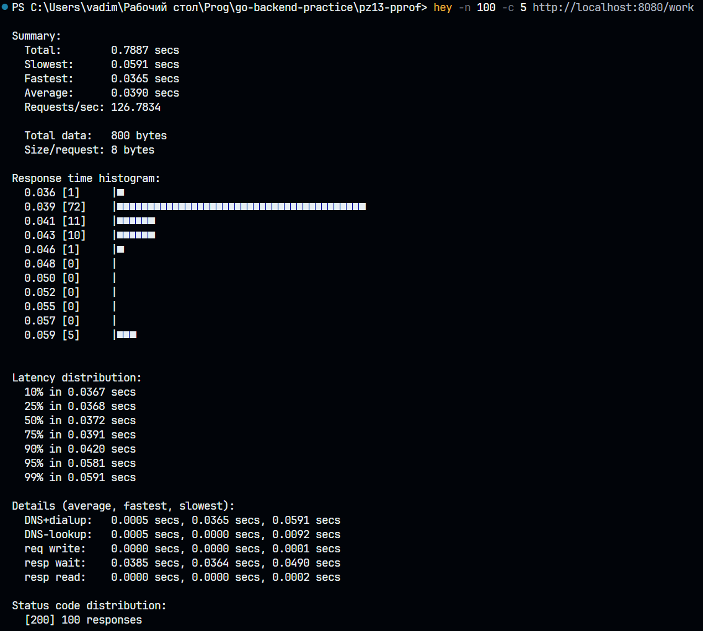
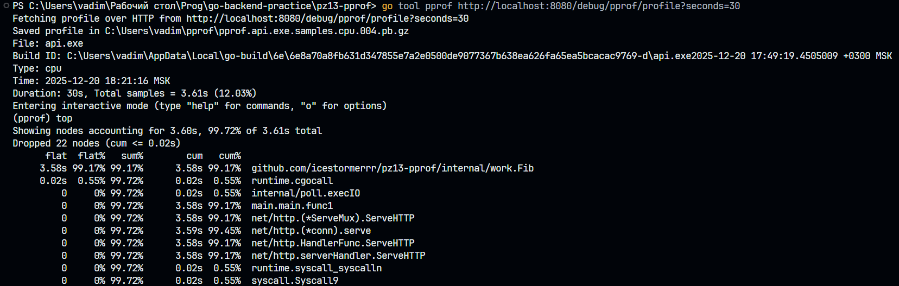
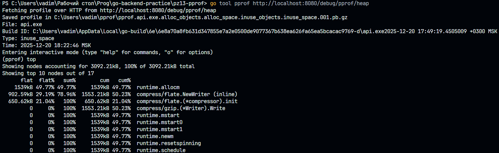
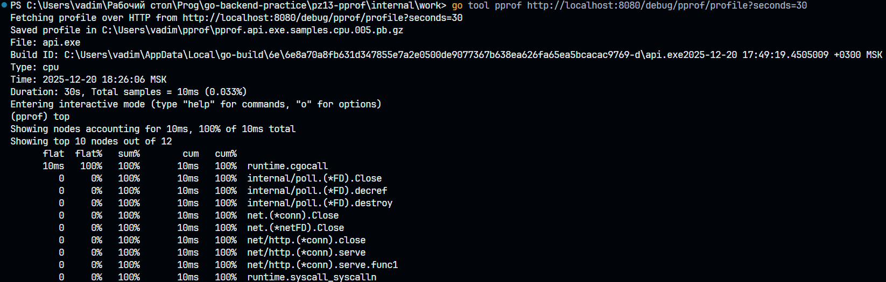
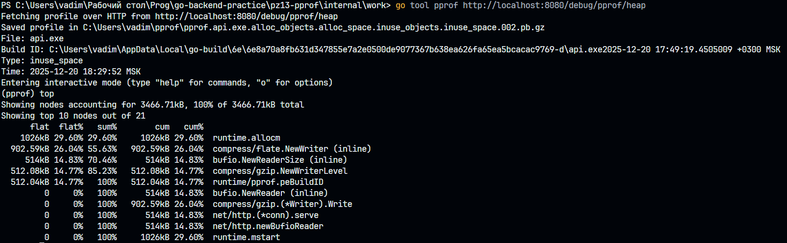
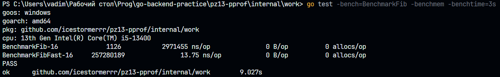

# Практическая работа № 13
Студент: Юркин В.И.

Группа: ПИМО-01-25

Тема: Профилирование Go-приложения (pprof). Измерение времени работы функций


Цели:
- Научиться подключать и использовать профилировщик pprof для анализа CPU, памяти, блокировок и горутин.
- Освоить базовые техники измерения времени выполнения функций (ручные таймеры, бенчмарки).
- Научиться читать отчёты go tool pprof, строить графы вызовов и находить “узкие места”.
- Сформировать практические навыки оптимизации кода на основании метрик.


## Структура проекта

```
PZ10-AUTH
├── cmd
│   └── api
│       └── main.go           # Точка входа и сервер приложения
├── internal
│   ├── work                   
│   │   ├── slow.go         # Тяжелые для выполнения функции
│   │   ├── slow_test.go    # Бенчмарки для тяжелых функций
│   │   └── timer.go        # Таймер

```

## Запуск
Golang: 1.24.0

```bash
cd pz13-pprof
```
```bash
go install github.com/rakyll/hey@latest
```
```bash
$env:Path += ";C:\Users\USER_NAME\go\bin"
```
```bash
go run ./cmd/api
```
Сервер доступен: http://localhost:8080
PPROF доступен: http://localhost:8080/debug/pprof/

## Демонстрация работы (Windows 11)

### 1. Нагрузочное тестирование (до оптимизации)

Запускаем 100 запросов, 5 параллельных соединений

```bash
hey -n 100 -c 5 http://localhost:8080/work
```


### 2. Сбор cpu профиля (до оптимизации)
> Должно быть запущено во время выполнения запросов
```
go tool pprof http://localhost:8080/debug/pprof/profile?seconds=30
```


### 3. Сбор Heap-профиля (до оптимизации)

```
go tool pprof http://localhost:8080/debug/pprof/heap
```


### 4. Нагрузочное тестирование (после оптимизации)

Запускаем 100 запросов, 5 параллельных соединений

```bash
hey -n 100 -c 5 http://localhost:8080/work-fast
```

### 5. Сбор cpu профиля (после оптимизации)
> Должно быть запущено во время выполнения запросов
```
go tool pprof http://localhost:8080/debug/pprof/profile?seconds=30
```

### 6. Сбор Heap-профиля (после оптимизации)

```
go tool pprof http://localhost:8080/debug/pprof/heap
```


### 7. Сравнение бенчмарков

