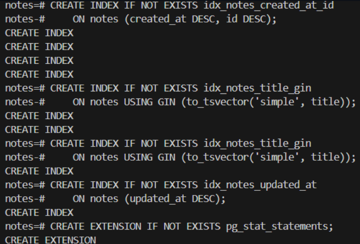
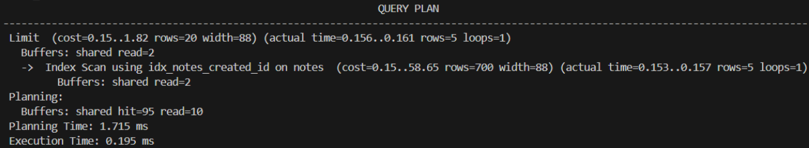
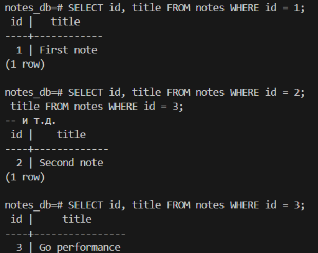
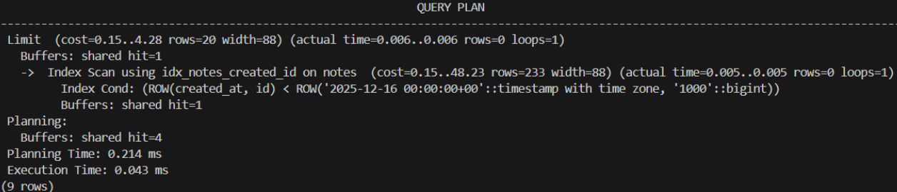
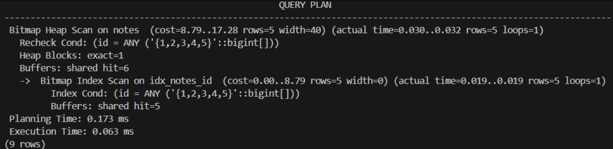
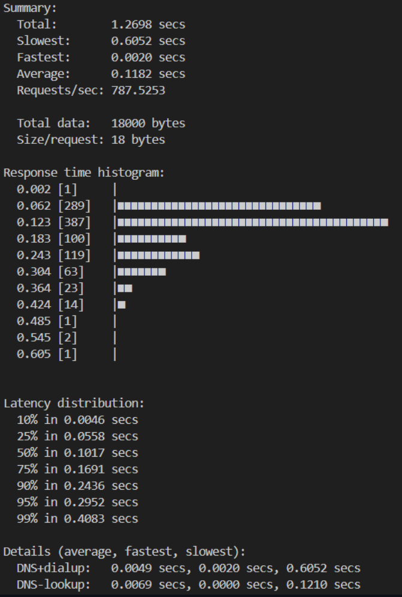
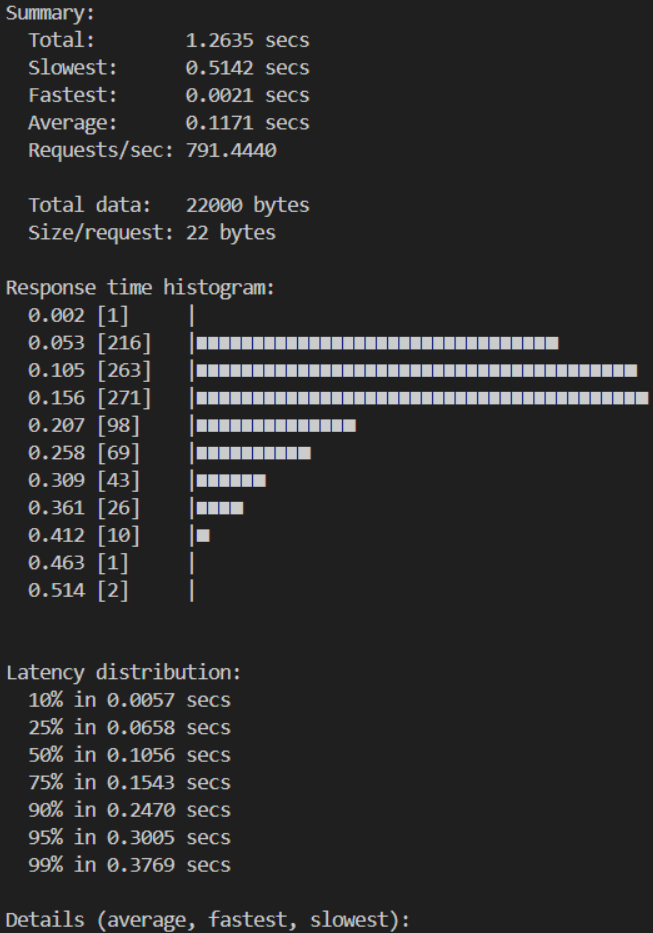

# Практическая работа № 8
Студент: Юркин В.И.
Группа: ПИМО-01-25

Тема: Оптимизация запросов к БД. Использование connection pool

Цели:
- Научиться находить «узкие места» в SQL-запросах и устранять их (индексы, переписывание запросов, пагинация, батчинг).
- Освоить настройку пула подключений (connection pool) в Go и параметры его тюнинга.
- Научиться использовать EXPLAIN/ANALYZE, базовые метрики (pg_stat_statements), подготовленные запросы и транзакции.
- Применить техники уменьшения N+1 запросов и сокращения аллокаций на горячем пути.

## Структура проекта
Дерево структуры проекта: 
```
pz14-query/
├── cmd/
│   └── api/
│       └── main.go
├── internal/
│   ├── core/
│   │   ├── note.go
│   │   └── types.go
│   ├── http/
│   │   ├── router.go
│   │   └── handlers/
│   │       └── notes.go
│   ├── db/
│   │   └── connection.go
│   └── repo/
│       ├── interface.go
│       ├── note_postgres.go
│       └── note_mem.go
├── docker-compose.yml
├── go.mod
└── go.sum
```

## Запуск

Docker: 25.0.3

Golang: 1.25.1


### Локально
1. Установка зависимостей
```bash
go mod tidy
```
3. Запуск сервера
```bash
go mod run
```

### На сервере
1. Развёртывание сервера
```bash
docker-compose up --build -d
```

## Скриншоты

1. Индексы



2. Неоптимизированная пагинация с OFFSET



3. Множественные одиночные запросы (N+1)



4. Keyset-пагинация (оптимизированная)



5. Батчинг вместо N+1



## Нагрузочное тестирование

1. Keyset-пагинация

```
hey -n 1000 -c 100 http://localhost:8080/api/v1/notes\?page_size=20
```



2. Батчинг

```
hey -n 1000 -c 100 http://localhost:8080/api/v1/notes/batch\?ids=1,2,3,4
```



## Вывод

В ходе работы были применены три ключевые техники оптимизации: создание индексов на часто используемых столбцах (B-Tree, GIN, покрывающие), переход с OFFSET/LIMIT на keyset-пагинацию и замена N+1 запросов на батчинг. Настройка connection pool (MaxOpenConns=25, MaxIdleConns=12) обеспечила баланс между пропускной способностью и нагрузкой на БД.
