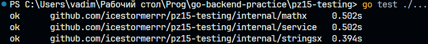
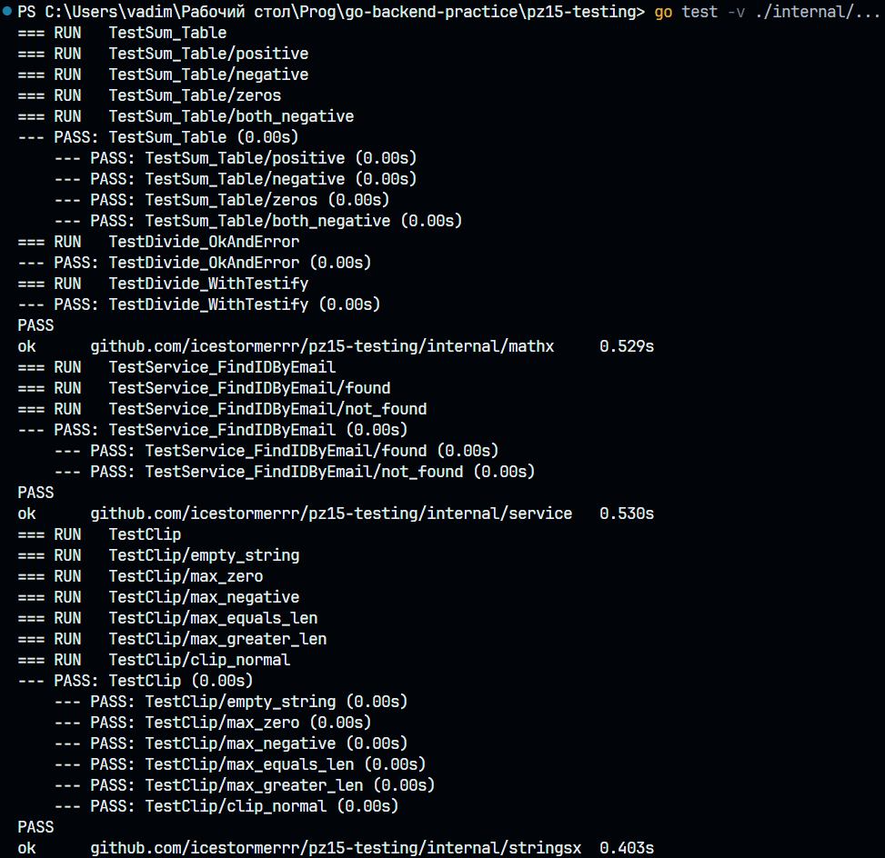
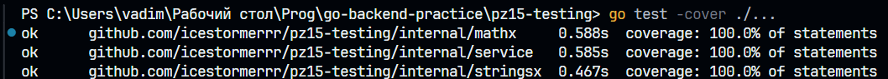
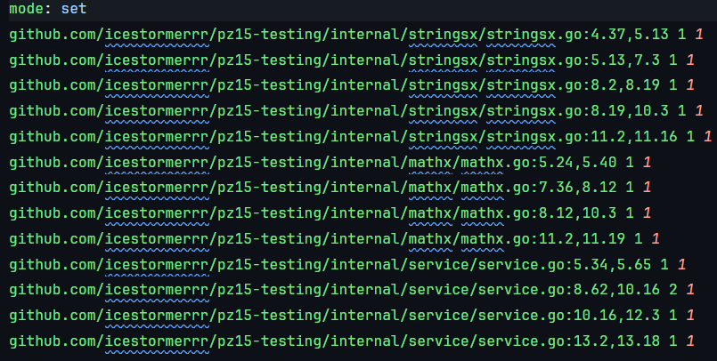
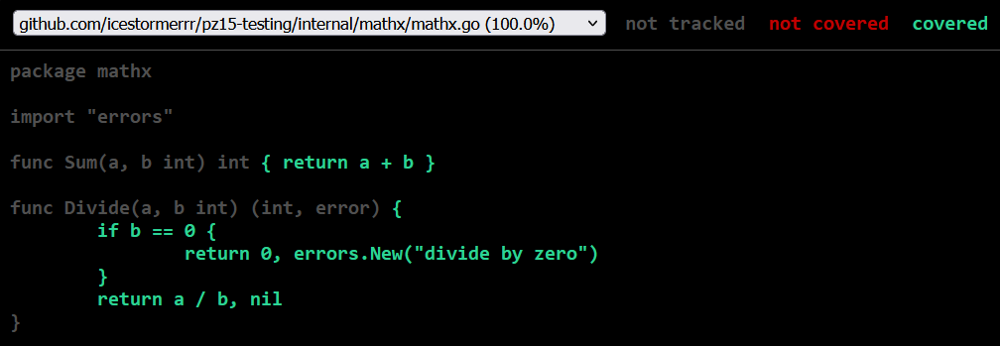

# Практическая работа № 15
Студент: Юркин В.И.

Группа: ПИМО-01-25

Тема: Unit-тестирование функций (testing, testify)


Цели:
-	Освоить базовые приёмы unit-тестирования в Go с помощью стандартного пакета testing.
-	Научиться писать табличные тесты, подзадачи t.Run, тестировать ошибки и паники.
-	Освоить библиотеку утверждений testify (assert, require) для лаконичных проверок.
-	Научиться измерять покрытие кода (go test -cover) и формировать html-отчёт покрытия.
-	Подготовить минимальную структуру проектных тестов и общий чек-лист качества тестов.


## Структура проекта:
```
pz15-tests/
├── internal/
│   ├── mathx/
│   │   ├── mathx.go
│   │   └── mathx_test.go
│   ├── stringsx/
│   │   ├── stringsx.go
│   │   └── stringsx_test.go
│   └── service/
│       ├── repo.go
│       ├── service.go
│       └── service_test.go
├── go.mod
└── go.sum
```

## Запуск
Golang: 1.24.0

```bash
cd pz15-testing
```
```bash
go mod tidy
```


### 2. **Тестим работу:**

```
go test ./...
```

```
go test -v ./internal/...
```

```
go test -cover ./...
```

```
go test -coverprofile=coverage.out ./...
```

```
go tool cover -html=coverage
```


