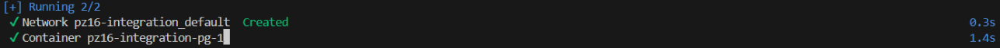
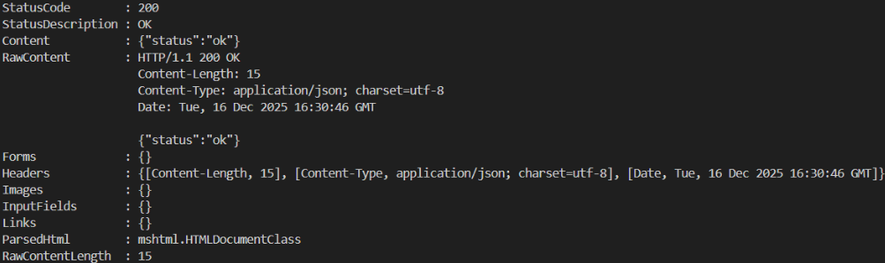
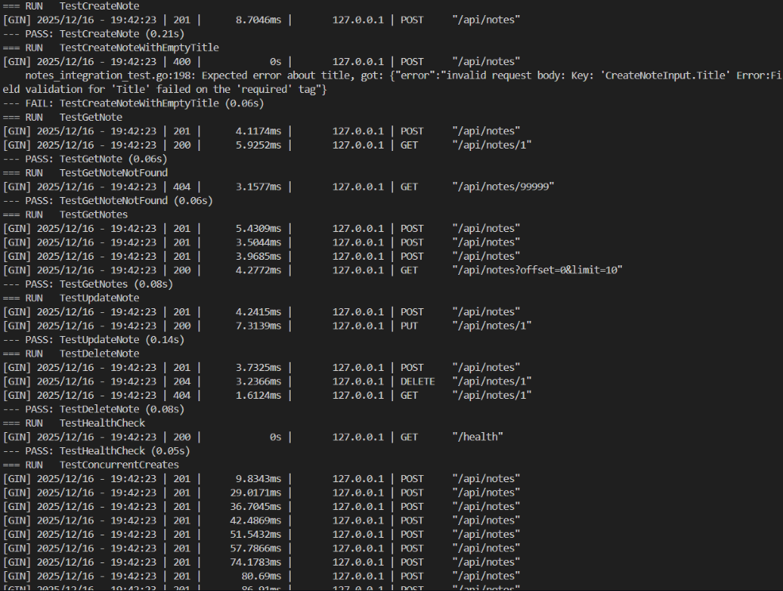

# Практическая работа № 16

Студент: Юркин В.И.
Группа: ПИМО-01-25

Тема: Интеграционное тестирование API. Использование Docker для тестовой БД

Цели:
- Освоить интеграционное тестирование REST API: проверка «маршрут → хендлер → сервис → репозиторий → реальная БД».
- Научиться поднимать изолированную тестовую среду БД в Docker.
- Освоить 2 подхода к инфраструктуре тестов:
	A. Локальная среда через docker-compose (просто и наглядно).
	B. Программный подъём контейнеров через testcontainers-go (изолировано и удобно для CI).
- Научиться инициализировать схему БД (миграции/auto-migrate), сидировать тестовые данные, очищать окружение.
- Внедрить интеграционные проверки CRUD-эндпоинтов (статусы, заголовки, JSON-ответы, эффекты в БД).


## Структура проекта
Дерево структуры проекта: 
```
pz16-integration/
├── cmd/api/
│   └── main.go 
│
├── internal/
│   ├── models/
│   │   └── note.go
│   │
│   ├── repo/
│   │   └── postgres.go
│   │
│   ├── service/
│   │   └── service.go
│   │
│   ├── httpapi/
│   │   └── handlers.go 
│   │
│   └── db/
│       └── migrate.go 
│
├── integration/
│   └── notes_integration_test.go 
│
├── docker-compose.yml
├── README.md 
├── go.mod
└── go.sum

```

## Скриншоты

```bash
docker-compose up -d
```



```bash
curl http://localhost:8080/health
```


```bash
go test -v ./integration/...
```



## Выводы

В рамках практической работы были выполнены интеграционные проверки REST API заметок с реальной PostgreSQL, поднятой в Docker.
Схема БД инициализируется автоматически через миграции.
Для изоляции тестов применяется очистка таблицы notes перед каждым тестом, поэтому результаты не зависят от порядка выполнения.
Отдельно проверены граничные и ошибочные случаи: 404 для отсутствующих сущностей и 400 для некорректных запросов.
