# Практическая работа № 3 - Юркин В.И.

## Описание проекта
Проект направлен на обучение основам golang

Цели:
- Освоить базовую работу со стандартной библиотекой net/http без сторонних фреймворков.
- Научиться поднимать HTTP-сервер, настраивать маршрутизацию через http.ServeMux.
- Научиться обрабатывать параметры запроса (query, path), тело запроса (JSON/form-data) и формировать корректные ответы (код статуса, заголовки, JSON).
- Научиться базовому логированию запросов и обработке ошибок

Требования:
1.	Поднимите сервер на :8080 и реализуйте маршруты:
-	GET /health — возвращает {"status":"ok"}.
-	GET /tasks — возвращает список задач, поддерживает фильтр ?q=.
-	POST /tasks — создаёт задачу по {"title":"..."}.
-	GET /tasks/{id} — возвращает одну задачу.
2.	Реализуйте единый helper для JSON-ответов и ошибок (как в примере).
3.	Добавьте middleware-логирование (метод, путь, статус, время).
4.	Напишите 6–8 тестовых запросов curl (или коллекцию Postman) и сохраните их в файле requests.md.
5. Дополнительная часть
-	PATCH /tasks/{id} для изменения флага done.
-	DELETE /tasks/{id}.
-	Валидация: title не короче 3 и не длиннее 140 символов — иначе 422.
-	Простейший CORS-middleware.
-	Вынесите конфигурацию порта в переменную окружения PORT (по умолчанию 8080).
-	Добавьте Makefile или PowerShell-скрипт с целями run, build, test.
-	Покройте 1–2 обработчика юнит-тестами (httptest.NewRecorder).


##	Структура проекта

```
pz3-http/
├── docs/                    # Материалы для документации
├── cmd/
│   └── server/
│       └── main.go          # Точка входа приложения
├── internal/
│   ├── api/                 # Слой для взаимодействия с приложением
│   │   ├── handlers.go      # Обработчики http запросов
│   │   ├── handlers_test.go # Unit тесты обработчиков http запросов
│   │   ├── middlewares.go   # Мидлвары, т.е. код, который исполняется для каждого запроса
│   │   ├── responses.go     # Утилиты для http ответов
│   └── storage/             # Слой для работы с данными
│       ├── memory.go        # Хранилище (только в ОЗУ)
```

## Установка и запуск

### Установка
Установка зависимостей
```bash
go mod tidy
```

### Отладка
Запуск проекта в режиме разработки
```bash
make run
```

### Билд
Билд проекта
```bash
make build
```
Запуск билда
```bash
.\server
```

## Конфигурация
Переменные окружения:
- PORT - порт, на котором работает сервер (необязательно, по-умолчанию 8080)

## Тестовые запросы (Windows)
### 1. Проверка работы сервера
```bash
curl http://localhost:8080/health
```
Результат:

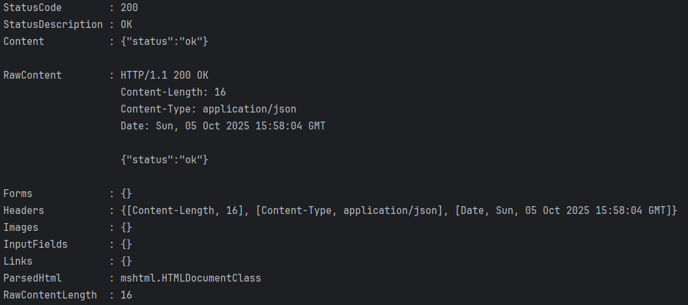

### 2. Создание нового дела
```bash
curl -Method POST http://localhost:8080/tasks -Body '{"title":"Buy milk"}' -Headers @{"Content-Type"="application/json"} 
```

Результат:

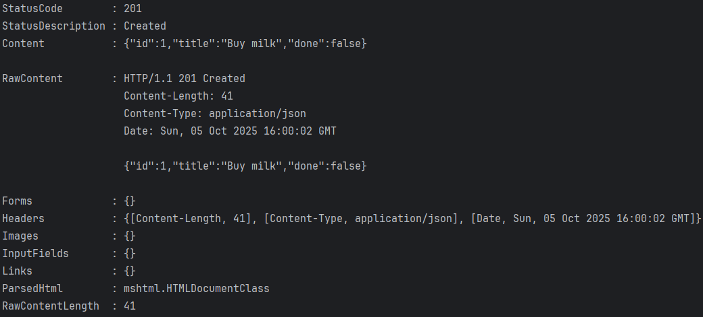

### 3. Создание нового дела
```bash
curl -Method POST http://localhost:8080/tasks -Body '{"title":"Send letter"}' -Headers @{"Content-Type"="application/json"}
```
Результат:

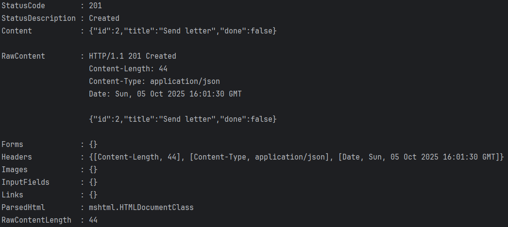

### 4. Получение списка дел
```bash
curl http://localhost:8080/tasks
```
Результат:

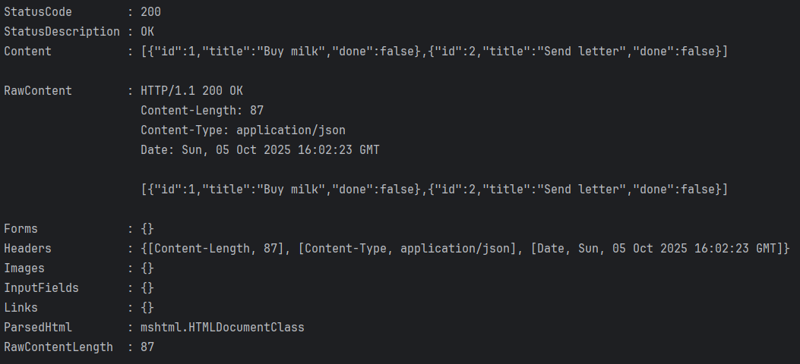

### 5. Получение списка дел (с фильтрацией по названию)
```bash
curl "http://localhost:8080/tasks?q=milk"
```
Результат:

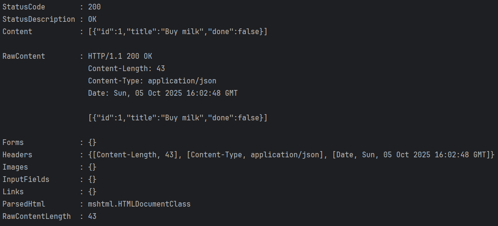

### 6. Обновление статуса выполнения дела
```bash
curl -Method PATCH http://localhost:8080/tasks/1 -Body '{"done":true}' -Headers @{"Content-Type"="application/json"}
```
Результат:

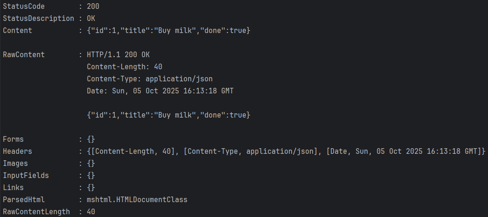

### 7. Получение списка дел
```bash
curl http://localhost:8080/tasks
```
Результат:

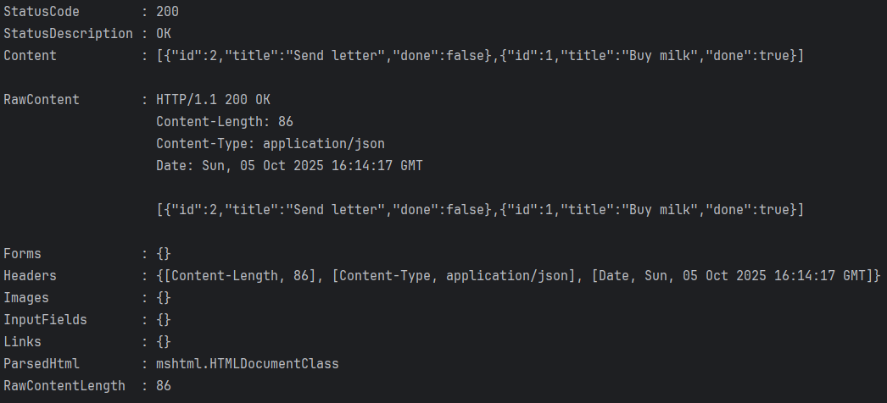

### 8. Удаление дела
```bash
curl -Method DELETE http://localhost:8080/tasks/1
```
Результат:

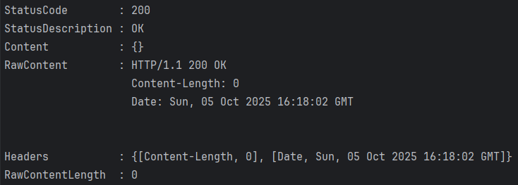

### 9. Получение списка дел
```bash
curl http://localhost:8080/tasks
```
Результат:

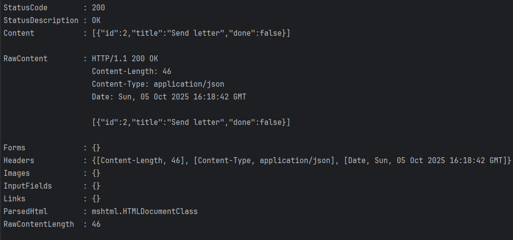

### 10. Получение дела по id (успешное)
```bash
curl http://localhost:8080/tasks/2
```
Результат:

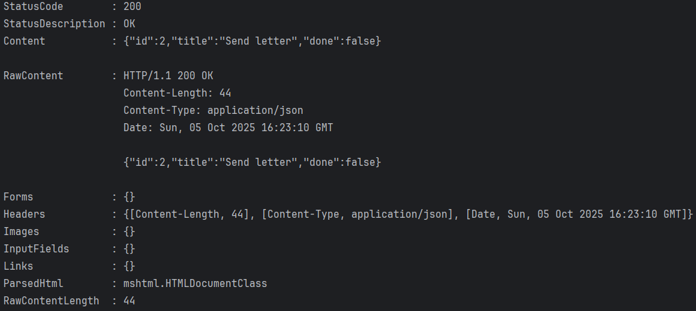

### 11. Получение дела по id (несуществующий)
```bash
curl http://localhost:8080/tasks/22
```
Результат:

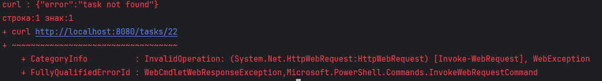


### 12. Создание нового дела (с пустым названием)
```bash
curl -Method POST http://localhost:8080/tasks -Body '{"title":""}' -Headers @{"Content-Type"="application/json"}
```
Результат:

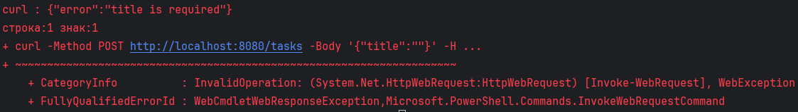


