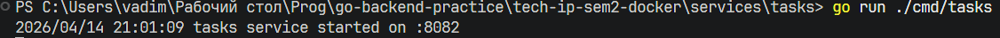
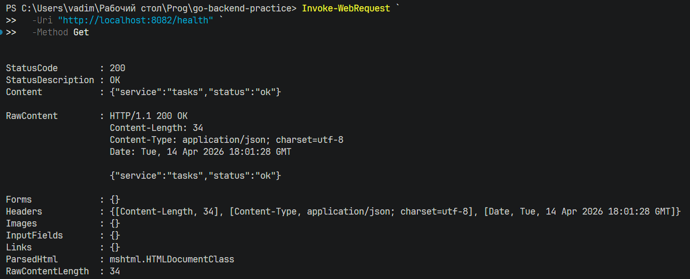
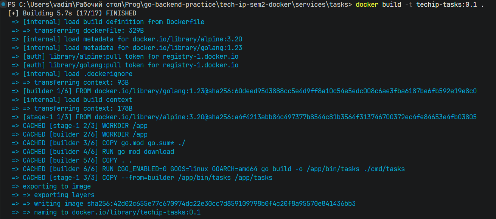
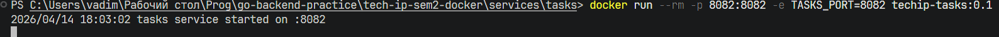
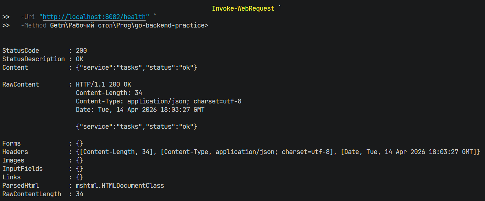
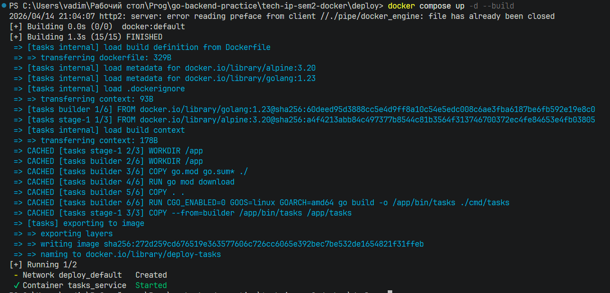
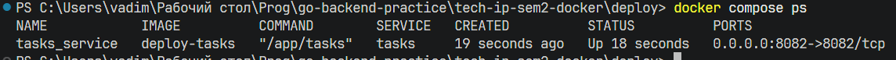
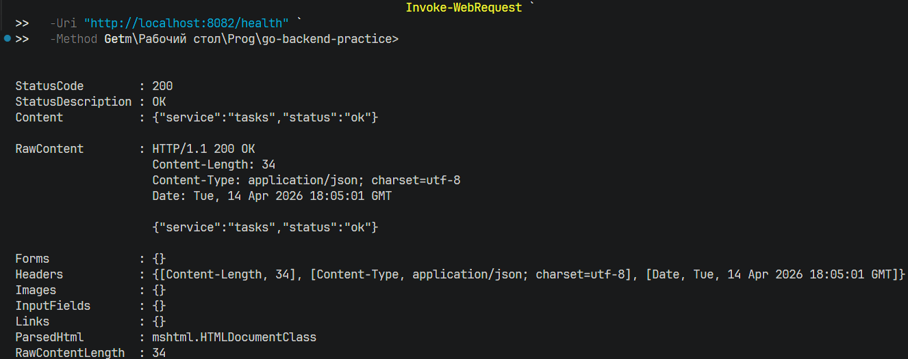
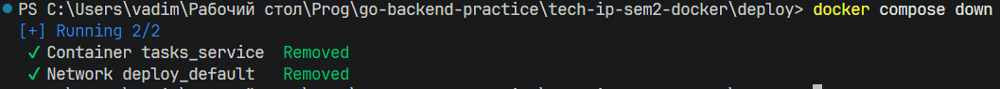
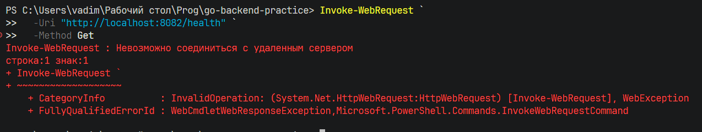

# Практическая работа № 23

Студент: Юркин В.И.

Группа: ПИМО-01-25

Тема: Написание Dockerfile и сборка контейнера

Цель: Освоить контейнеризацию backend-приложения на Go с помощью Docker, научиться писать Dockerfile, собирать Docker-образ и запускать контейнеризированный сервис в воспроизводимой среде.

## Что реализовано

- минимальный `tasks` HTTP-сервис с маршрутом `GET /health`
- отдельный `Dockerfile` для multi-stage сборки Go-приложения
- `.dockerignore` для чистого build context
- `docker-compose.yml` для запуска сервиса через Docker Compose
- env-конфигурация порта приложения через `TASKS_PORT`

## Структура

```text
tech-ip-sem2-docker/                  - корень проекта практической работы
├── services/
│   └── tasks/                        - учебный tasks-сервис
│       ├── cmd/
│       │   └── tasks/
│       │       └── main.go           - точка входа HTTP-сервиса
│       ├── .dockerignore             - исключения из Docker build context
│       ├── Dockerfile                - multi-stage сборка контейнера
│       └── go.mod                    - Go-модуль tasks-сервиса
├── deploy/
│   └── docker-compose.yml            - запуск tasks через Docker Compose
└── README.md                         - инструкция сборки и запуска
```

## Локальный запуск без Docker

Из каталога `services/tasks`:

```powershell
go run ./cmd/tasks
```



Проверка:




## Сборка образа

Из каталога `services/tasks`:

```powershell
docker build -t techip-tasks:0.1 .
```




## Запуск контейнера

```powershell
docker run --rm -p 8082:8082 -e TASKS_PORT=8082 techip-tasks:0.1
```



Проверка:

```powershell
Invoke-WebRequest `
  -Uri "http://localhost:8082/health" `
  -Method Get
```



## Запуск через Docker Compose

Из каталога `deploy`:

```powershell
docker compose up -d --build
```



Проверка статуса:

```powershell
docker compose ps
```



Просмотр логов:

```powershell
docker compose logs -f
```


После запуска через Compose проверка остаётся той же:

```powershell
Invoke-WebRequest `
  -Uri "http://localhost:8082/health" `
  -Method Get
```


Остановка:

```powershell
docker compose down
```



