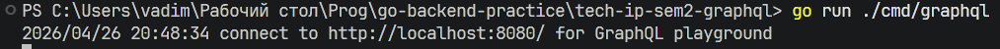
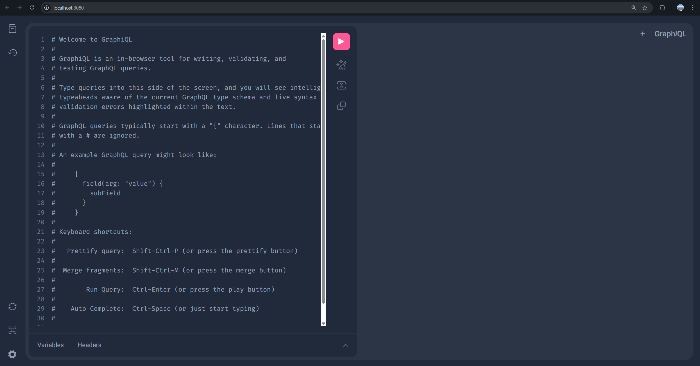
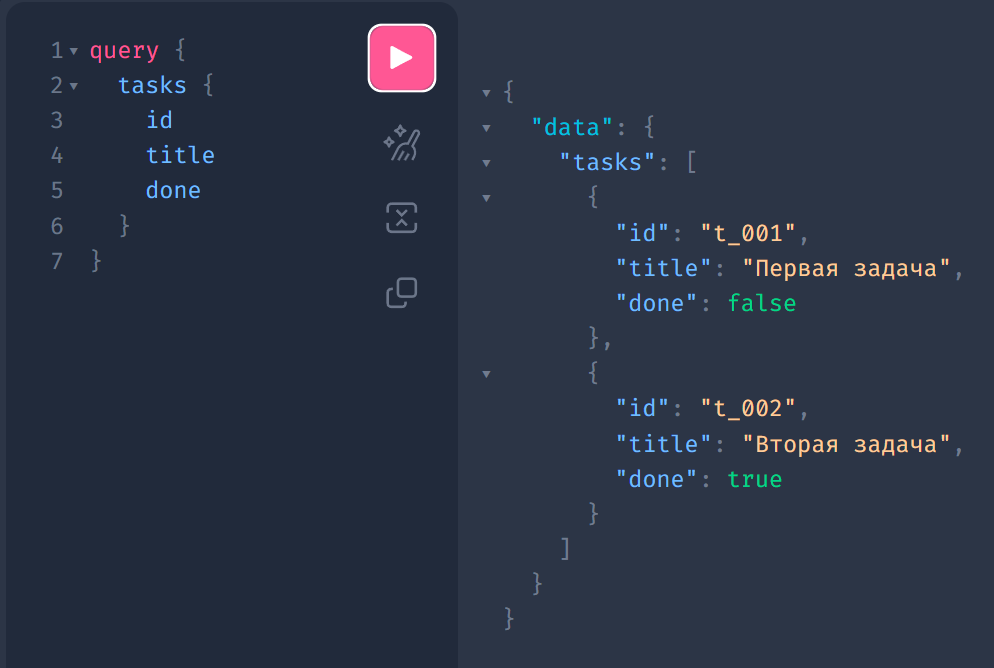
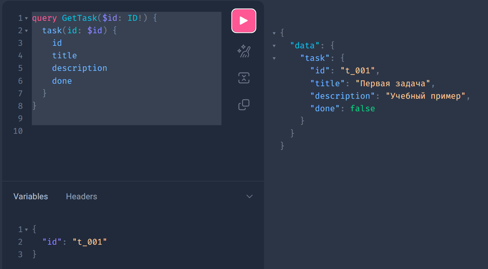
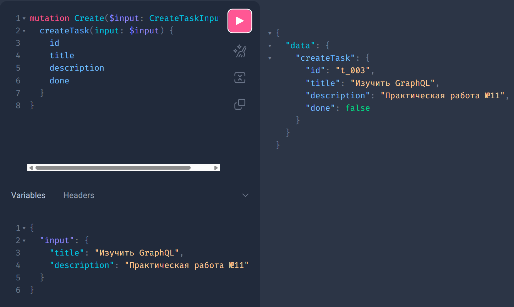
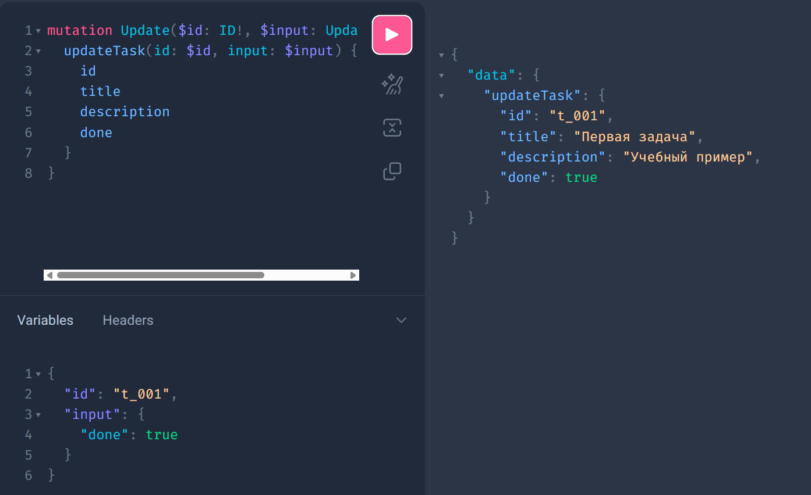
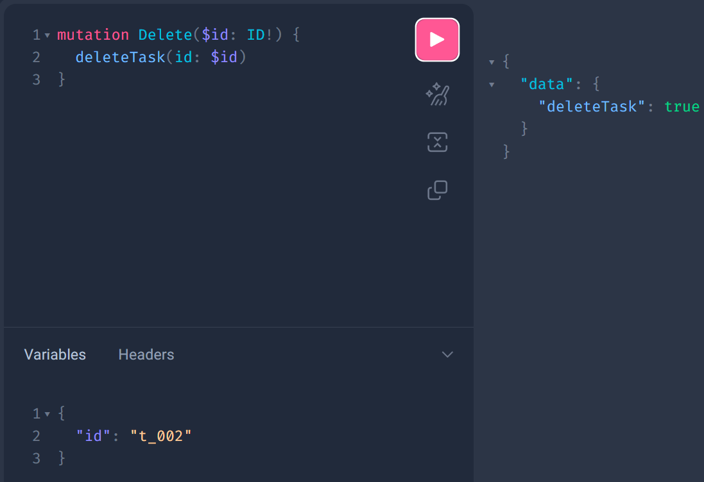

# Практическая работа № 27

Студент: Юркин В.И.

Группа: ПИМО-01-25

Тема: Создание GraphQL API с использованием gqlgen. Запросы и мутации

Цель: Освоить разработку GraphQL API на языке Go с использованием библиотеки gqlgen, научиться описывать GraphQL-схему, генерировать серверный каркас приложения, реализовывать резолверы для запросов и мутаций, а также тестировать работу API через Playground.

## Что реализовано

- GraphQL API для сущности `Task`
- схема с `Query` и `Mutation` в [schema.graphqls](graph/schema.graphqls)
- генерация серверного каркаса через `gqlgen`
- in-memory store для учебной работы в [store.go](internal/store/store.go)
- резолверы для чтения, создания, обновления и удаления задач в [schema.resolvers.go](graph/schema.resolvers.go)
- GraphQL Playground и endpoint `/query` в [main.go](cmd/graphql/main.go)

## Структура

```text
tech-ip-sem2-graphql/                 - корень проекта практической работы
├── cmd/
│   └── graphql/
│       └── main.go                   - запуск GraphQL-сервера и Playground
├── graph/
│   ├── generated.go                  - сгенерированный gqlgen код
│   ├── resolver.go                   - зависимости резолверов
│   ├── schema.graphqls               - GraphQL-схема Task API
│   ├── schema.resolvers.go           - реализация query и mutation резолверов
│   └── model/
│       └── models_gen.go             - сгенерированные GraphQL-модели
├── internal/
│   └── store/
│       └── store.go                  - in-memory хранилище задач
├── go.mod                            - Go-модуль проекта
├── gqlgen.yml                        - конфигурация gqlgen
└── README.md                         - инструкция запуска и примеры запросов
```

## GraphQL-схема

```graphql
type Task {
  id: ID!
  title: String!
  description: String
  done: Boolean!
}

type Query {
  tasks: [Task!]!
  task(id: ID!): Task
}

type Mutation {
  createTask(input: CreateTaskInput!): Task!
  updateTask(id: ID!, input: UpdateTaskInput!): Task!
  deleteTask(id: ID!): Boolean!
}
```

## Запуск

Из корня проекта:

```powershell
go run ./cmd/graphql
```



После запуска откройте:

```text
http://localhost:8080/
```



Это откроет GraphQL Playground.

## Примеры запросов

### Получение списка задач

```graphql
query {
  tasks {
    id
    title
    done
  }
}
```



### Получение задачи по ID

```graphql
query GetTask($id: ID!) {
  task(id: $id) {
    id
    title
    description
    done
  }
}
```

Переменные:

```json
{
  "id": "t_001"
}
```



### Создание задачи

```graphql
mutation Create($input: CreateTaskInput!) {
  createTask(input: $input) {
    id
    title
    description
    done
  }
}
```

Переменные:

```json
{
  "input": {
    "title": "Изучить GraphQL",
    "description": "Практическая работа №11"
  }
}
```



### Обновление задачи

```graphql
mutation Update($id: ID!, $input: UpdateTaskInput!) {
  updateTask(id: $id, input: $input) {
    id
    title
    description
    done
  }
}
```

Переменные:

```json
{
  "id": "t_001",
  "input": {
    "done": true
  }
}
```



### Удаление задачи

```graphql
mutation Delete($id: ID!) {
  deleteTask(id: $id)
}
```

Переменные:

```json
{
  "id": "t_002"
}
```



