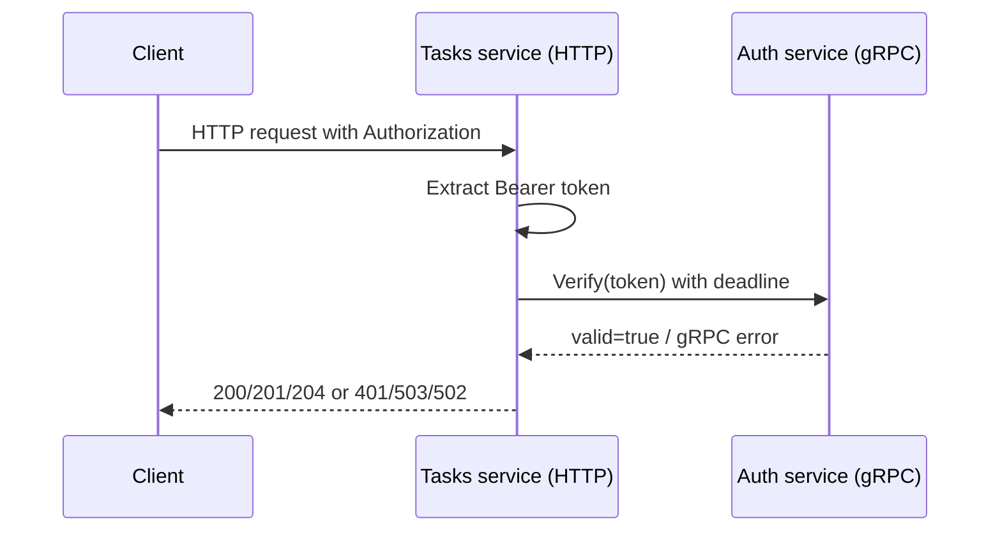

# PZ18 API

## Цель работы

В этой практике проверка токена вынесена из HTTP-вызова во внутренний gRPC-вызов:
- `Auth service` поднимает gRPC-сервер и реализует метод `Verify`;
- `Tasks service` остаётся HTTP API для клиента, но для проверки доступа вызывает `Auth service` по gRPC;
- каждый gRPC-вызов выполняется с `deadline`, чтобы Tasks service не зависал при недоступности Auth service.

## Границы ответственности сервисов

### Auth service

Auth service отвечает только за учебную авторизацию и проверку токена:
- принимает логин и пароль через HTTP `POST /v1/auth/login`;
- возвращает фиксированный токен `demo-token`;
- поднимает gRPC-сервер `AuthService`;
- реализует метод `Verify`, который проверяет токен;
- возвращает gRPC-ошибки `Unauthenticated` или `Internal`.

### Tasks service

Tasks service отвечает только за задачи:
- хранит задачи в памяти;
- предоставляет HTTP CRUD API для задач;
- перед каждой защищённой операцией вызывает `AuthService.Verify`;
- задаёт `deadline` для gRPC-вызова;
- маппит gRPC-ошибки в HTTP-статусы.

## Архитектура взаимодействия



## Переменные окружения

### Auth service

- `AUTH_HTTP_PORT` - HTTP-порт для `login` и совместимого `verify`, по умолчанию `8081`
- `AUTH_GRPC_PORT` - gRPC-порт для `Verify`, по умолчанию `50051`

### Tasks service

- `TASKS_PORT` - HTTP-порт Tasks service, по умолчанию `8082`
- `AUTH_GRPC_ADDR` - адрес Auth gRPC server, по умолчанию `localhost:50051`
- `AUTH_GRPC_TIMEOUT_MS` - deadline для gRPC-вызова в миллисекундах, по умолчанию `1500`

## gRPC-контракт

Файл контракта: `proto/auth.proto`

```proto
syntax = "proto3";

package auth.v1;

option go_package = "tech-ip-sem2-grpc/proto/authpb;authpb";

service AuthService {
  rpc Verify(VerifyRequest) returns (VerifyResponse);
}

message VerifyRequest {
  string token = 1;
}

message VerifyResponse {
  bool valid = 1;
  string subject = 2;
}
```

### Смысл полей

#### VerifyRequest

- `token` - токен доступа без префикса `Bearer`

#### VerifyResponse

- `valid` - признак валидности токена
- `subject` - идентификатор пользователя, для учебной версии это `student`

## Генерация protobuf-кода

Сгенерированные файлы находятся в каталоге `proto/authpb/`.

Фактически использованная команда генерации:

```powershell
protoc `
  --go_out=. --go_opt=module=tech-ip-sem2-grpc `
  --go-grpc_out=. --go-grpc_opt=module=tech-ip-sem2-grpc `
  proto/auth.proto
```

Использованные инструменты:
- `protoc 28.2`
- `protoc-gen-go v1.34.1`
- `protoc-gen-go-grpc v1.5.1`

## Auth service API

Основная проверка токена выполняется через gRPC. HTTP в Auth service оставлен для удобства демонстрации логина и совместимости.

### POST /v1/auth/login

Упрощённая авторизация. В учебной версии принимаются учётные данные `student/student`.

Запрос:

```json
{
  "username": "student",
  "password": "student"
}
```

Успешный ответ `200 OK`:

```json
{
  "access_token": "demo-token",
  "token_type": "Bearer"
}
```

Ошибки:
- `400 Bad Request` - невалидный JSON или отсутствуют обязательные поля
- `401 Unauthorized` - неверные учётные данные

Пример PowerShell-запроса:

```powershell
$loginBody = @{
  username = "student"
  password = "student"
} | ConvertTo-Json -Compress

Invoke-RestMethod `
  -Uri "http://localhost:8081/v1/auth/login" `
  -Method Post `
  -Headers @{ "X-Request-ID" = "req-101" } `
  -ContentType "application/json" `
  -Body $loginBody
```

### GET /v1/auth/verify

Этот endpoint оставлен как дополнительный HTTP-вариант проверки токена. В основной логике проекта Tasks service использует не его, а gRPC-метод `Verify`.

Заголовки:
- `Authorization: Bearer demo-token`
- `X-Request-ID: req-102`

Успешный ответ `200 OK`:

```json
{
  "valid": true,
  "subject": "student"
}
```

Ошибка `401 Unauthorized`:

```json
{
  "valid": false,
  "error": "unauthorized"
}
```

## Auth service gRPC API

### AuthService.Verify

Метод вызывается из Tasks service перед каждой операцией с задачами.

Входные данные:

```text
token = "demo-token"
```

Успешный ответ:

```text
valid = true
subject = "student"
```

Ошибки gRPC:
- `codes.Unauthenticated` - токен отсутствует, пустой или невалидный
- `codes.Internal` - внутренняя ошибка сервиса авторизации

## Tasks service API

Во всех запросах к Tasks service ожидается заголовок:
- `Authorization: Bearer demo-token`
- опционально `X-Request-ID`

Перед выполнением любой операции service:
1. извлекает токен из `Authorization`;
2. вызывает `AuthService.Verify` по gRPC;
3. только при успешной проверке выполняет CRUD-операцию.

### POST /v1/tasks

Создание задачи.

Запрос:

```json
{
  "title": "Learn gRPC",
  "description": "Replace HTTP verify with gRPC verify",
  "due_date": "2026-03-25"
}
```

Ответ `201 Created`:

```json
{
  "id": "t_001",
  "title": "Learn gRPC",
  "description": "Replace HTTP verify with gRPC verify",
  "due_date": "2026-03-25",
  "done": false
}
```

Пример запроса:

```powershell
$taskBody = @{
  title = "Learn gRPC"
  description = "Replace HTTP verify with gRPC verify"
  due_date = "2026-03-25"
} | ConvertTo-Json -Compress

Invoke-RestMethod `
  -Uri "http://localhost:8082/v1/tasks" `
  -Method Post `
  -Headers @{
    Authorization = "Bearer demo-token"
    "X-Request-ID" = "req-103"
  } `
  -ContentType "application/json" `
  -Body $taskBody
```

### GET /v1/tasks

Получение списка задач.

Ответ `200 OK`:

```json
[
  {
    "id": "t_001",
    "title": "Learn gRPC",
    "description": "Replace HTTP verify with gRPC verify",
    "due_date": "2026-03-25",
    "done": false
  }
]
```

Пример запроса:

```powershell
Invoke-WebRequest `
  -Uri "http://localhost:8082/v1/tasks" `
  -Method Get `
  -Headers @{
    Authorization = "Bearer demo-token"
    "X-Request-ID" = "req-104"
  }
```

### GET /v1/tasks/{id}

Получение одной задачи по идентификатору.

Пример запроса:

```powershell
Invoke-WebRequest `
  -Uri "http://localhost:8082/v1/tasks/t_001" `
  -Method Get `
  -Headers @{
    Authorization = "Bearer demo-token"
    "X-Request-ID" = "req-105"
  }
```

### PATCH /v1/tasks/{id}

Обновление задачи.

Запрос:

```json
{
  "title": "Learn gRPC deeply",
  "done": true
}
```

Пример запроса:

```powershell
$patchBody = @{
  title = "Learn gRPC deeply"
  done = $true
} | ConvertTo-Json -Compress

Invoke-RestMethod `
  -Uri "http://localhost:8082/v1/tasks/t_001" `
  -Method Patch `
  -Headers @{
    Authorization = "Bearer demo-token"
    "X-Request-ID" = "req-106"
  } `
  -ContentType "application/json" `
  -Body $patchBody
```

### DELETE /v1/tasks/{id}

Удаление задачи.

Пример запроса:

```powershell
Invoke-WebRequest `
  -Uri "http://localhost:8082/v1/tasks/t_001" `
  -Method Delete `
  -Headers @{
    Authorization = "Bearer demo-token"
    "X-Request-ID" = "req-107"
  }
```

Ожидаемый ответ: `204 No Content`

## Ошибки и маппинг статусов

### Ошибки Auth service (HTTP)

- `400 Bad Request` - невалидный JSON или отсутствуют поля
- `401 Unauthorized` - неверный логин/пароль или невалидный токен

### Ошибки Auth service (gRPC)

- `codes.Unauthenticated` - токен невалиден
- `codes.Internal` - внутренняя ошибка Auth service

### Ошибки Tasks service (HTTP)

- `400 Bad Request` - невалидный JSON или некорректные поля запроса
- `401 Unauthorized` - отсутствует `Authorization` или gRPC `Verify` вернул `Unauthenticated`
- `404 Not Found` - задача не найдена
- `503 Service Unavailable` - Auth service недоступен или превышен `deadline`
- `502 Bad Gateway` - Auth service вернул неожиданную gRPC-ошибку

### Маппинг gRPC -> HTTP

- `codes.Unauthenticated` -> `401 Unauthorized`
- `codes.Unavailable` -> `503 Service Unavailable`
- `codes.DeadlineExceeded` -> `503 Service Unavailable`
- любые прочие gRPC-ошибки -> `502 Bad Gateway`

## Deadline и отказоустойчивость

Для каждого вызова `AuthService.Verify` в Tasks service создаётся `context.WithTimeout`.

Это даёт следующие эффекты:
- Tasks service не зависает бесконечно, если Auth service не отвечает;
- клиент получает предсказуемый HTTP-ответ `503 Service Unavailable`;
- в логах легко увидеть, что проблема возникла на этапе внутреннего gRPC-вызова.

## Что приложить в отчёт

Для отчёта по практике рекомендуется приложить:
- содержимое `proto/auth.proto`;
- команду генерации protobuf-кода;
- скриншоты или логи успешного вызова;
- скриншоты или логи сценария, когда Auth service недоступен;
- описание маппинга ошибок gRPC в HTTP;
- краткое пояснение, зачем нужен `deadline`.
