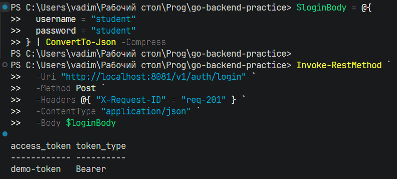
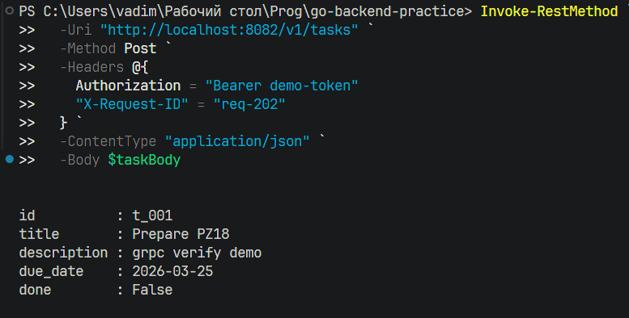
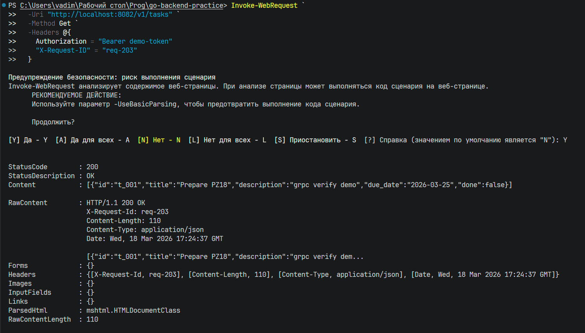
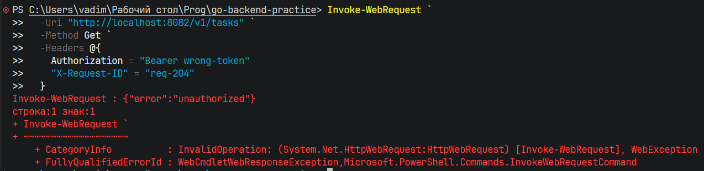
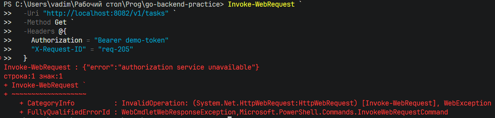
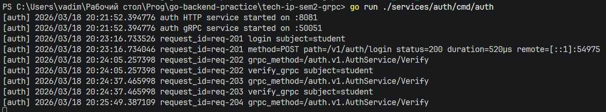
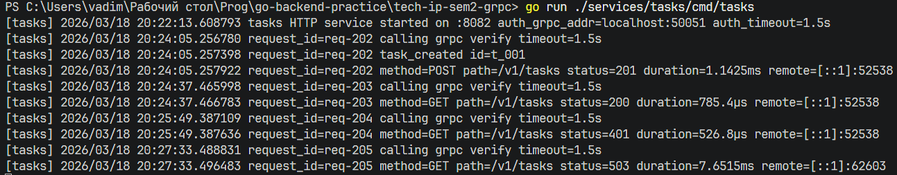

## 1. Получение токена

### Команда

```powershell
$loginBody = @{
  username = "student"
  password = "student"
} | ConvertTo-Json -Compress

Invoke-RestMethod `
  -Uri "http://localhost:8081/v1/auth/login" `
  -Method Post `
  -Headers @{ "X-Request-ID" = "req-201" } `
  -ContentType "application/json" `
  -Body $loginBody
```

### Результат



---

## 2. Создание задачи через Tasks service

### Команда

```powershell
$taskBody = @{
  title = "Prepare PZ18"
  description = "grpc verify demo"
  due_date = "2026-03-25"
} | ConvertTo-Json -Compress

Invoke-RestMethod `
  -Uri "http://localhost:8082/v1/tasks" `
  -Method Post `
  -Headers @{
    Authorization = "Bearer demo-token"
    "X-Request-ID" = "req-202"
  } `
  -ContentType "application/json" `
  -Body $taskBody
```

### Результат



---

## 3. Получение списка задач

### Команда

```powershell
Invoke-WebRequest `
  -Uri "http://localhost:8082/v1/tasks" `
  -Method Get `
  -Headers @{
    Authorization = "Bearer demo-token"
    "X-Request-ID" = "req-203"
  }
```

### Результат



---

## 4. Сценарий с невалидным токеном

### Команда

```powershell
Invoke-WebRequest `
  -Uri "http://localhost:8082/v1/tasks" `
  -Method Get `
  -Headers @{
    Authorization = "Bearer wrong-token"
    "X-Request-ID" = "req-204"
  }
```

### Результат



---

## 5. Сценарий недоступного Auth service

### Шаги

1. Остановите Auth service.
2. Повторите запрос на создание или чтение задач.

### Команда

```powershell
Invoke-WebRequest `
  -Uri "http://localhost:8082/v1/tasks" `
  -Method Get `
  -Headers @{
    Authorization = "Bearer demo-token"
    "X-Request-ID" = "req-205"
  }
```

### Результат



---

## Логи



