# Практическая работа № 32

Студент: Юркин В.И.

Группа: ПИМО-01-25

Тема: Публикация приложения в Kubernetes (минимальный манифест)

Цель: Освоить базовую публикацию контейнеризированного backend-приложения в Kubernetes, научиться описывать Deployment и Service, передавать конфигурацию через ConfigMap, настраивать readiness и liveness probes, применять манифесты через kubectl и проверять состояние Pod и Service. Такая логика полностью соответствует теме ПЗ 16 и опорным элементам: docker-образ сервиса tasks, Deployment, Service, ConfigMap, probes и проверка через kubectl и port-forward.

## Что реализовано

- минимальный HTTP-сервис `tasks`
- endpoint `GET /health` для `readinessProbe` и `livenessProbe`
- Dockerfile для сборки образа `techip-tasks:0.1`
- `ConfigMap` с конфигурацией приложения
- `Deployment` для запуска контейнера
- `Service` типа `ClusterIP`
- инструкции по проверке через `kubectl`, `describe`, `logs` и `port-forward`
- инструкции по масштабированию и удалению ресурсов

## Структура проекта

```text
tech-ip-sem2-k8s/
├── services/
│   └── tasks/
│       ├── .dockerignore
│       ├── Dockerfile
│       ├── go.mod
│       └── cmd/
│           └── tasks/
│               └── main.go
├── deploy/
│   └── k8s/
│       ├── configmap.yaml
│       ├── deployment.yaml
│       └── service.yaml
└── README.md
```

## Приложение

Сервис слушает HTTP-порт из переменной окружения `TASKS_PORT` и поддерживает endpoint:

- `GET /health`

Пример ответа:

```json
{
  "status": "ok",
  "service": "tasks"
}
```

## Docker-образ

В проекте используется фиксированный тег:

`techip-tasks:0.1`

Сборка образа:

```powershell
cd services/tasks
docker build -t techip-tasks:0.1 .
```

## Как сделать образ доступным кластеру

Для `minikube`:

```powershell
minikube docs/image load techip-tasks:0.1
```


## Проверка доступа к кластеру

```powershell
kubectl cluster-info
kubectl get nodes
```

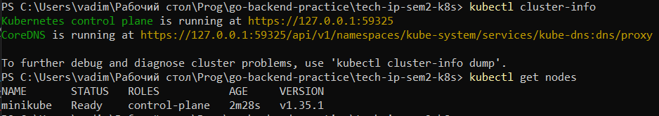


## Применение манифестов

Из корня проекта:

```powershell
kubectl apply -f deploy/k8s/configmap.yaml
kubectl apply -f deploy/k8s/deployment.yaml
kubectl apply -f deploy/k8s/service.yaml
```

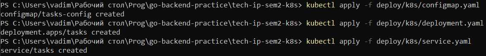

## Проверка Pod

```powershell
kubectl get pods
kubectl describe pod <pod-name>
```

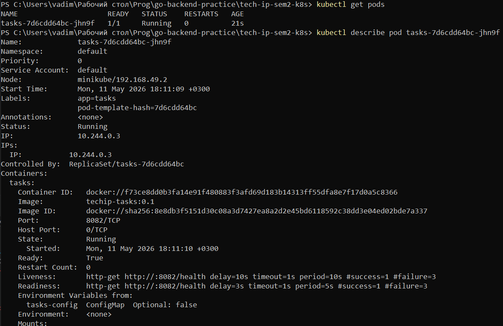

## Проверка Deployment

```powershell
kubectl get deployment
kubectl describe deployment tasks
```

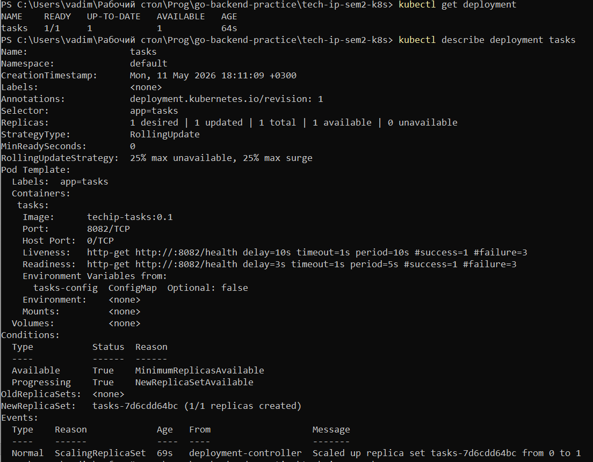

## Проверка Service

```powershell
kubectl get svc
kubectl describe svc tasks
```

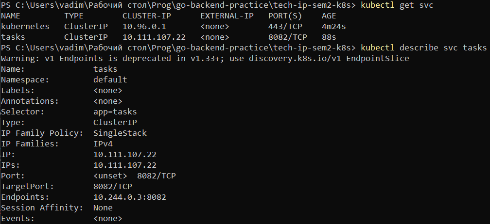

## Просмотр логов

```powershell
kubectl logs <pod-name>
```

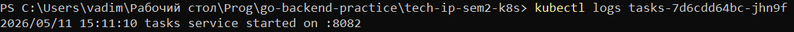

## Проверка через port-forward

Открой один терминал:

```powershell
kubectl port-forward svc/tasks 8082:8082
```

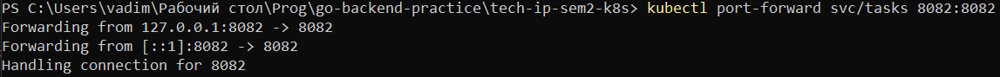

Во втором терминале:

```powershell
Invoke-WebRequest `
  -Uri "http://localhost:8082/health" `
  -Method Get
```

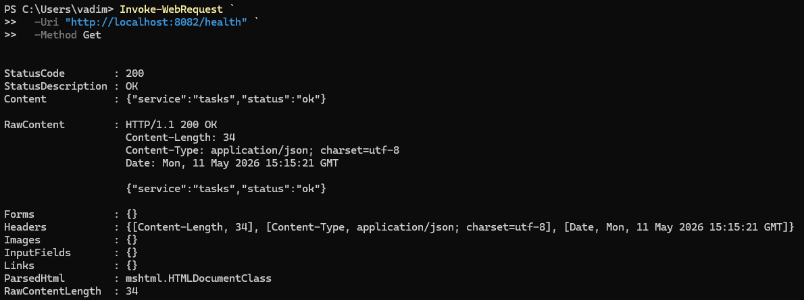

## Проверка readiness и liveness

```powershell
kubectl get pods
kubectl describe pod <pod-name>
```

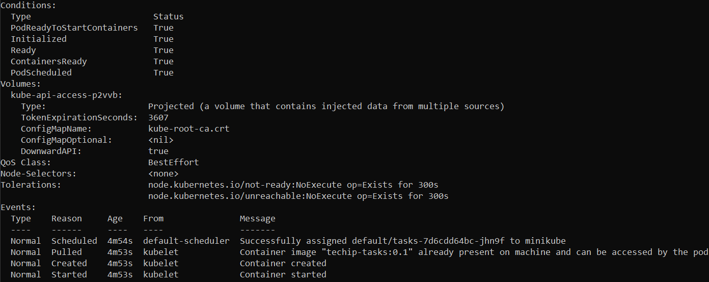

## Масштабирование

Увеличить число реплик:

```powershell
kubectl scale deployment tasks --replicas=2
kubectl get pods
```

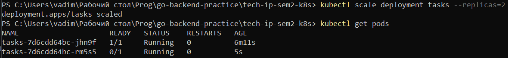

Вернуть одну реплику:

```powershell
kubectl scale deployment tasks --replicas=1
kubectl get pods
```

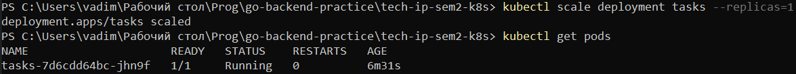

## Удаление ресурсов

```powershell
kubectl delete -f deploy/k8s/service.yaml
kubectl delete -f deploy/k8s/deployment.yaml
kubectl delete -f deploy/k8s/configmap.yaml
```

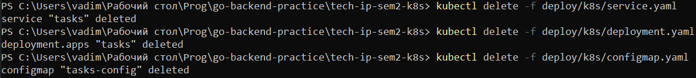

