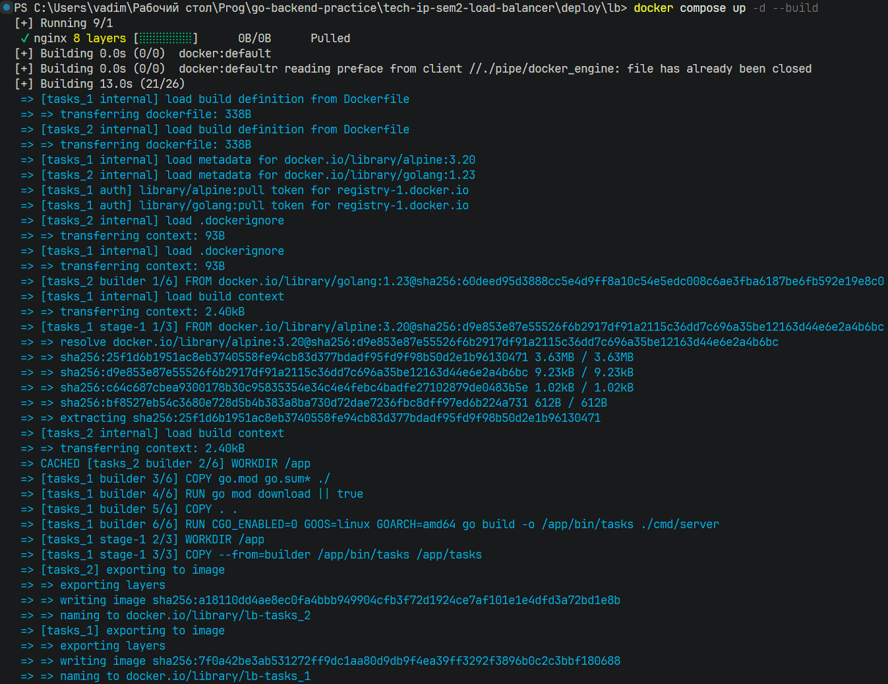
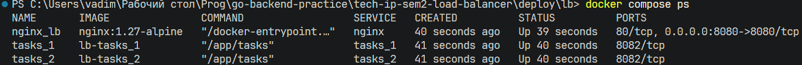
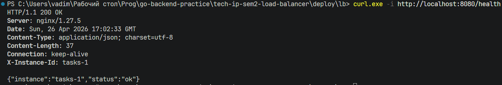
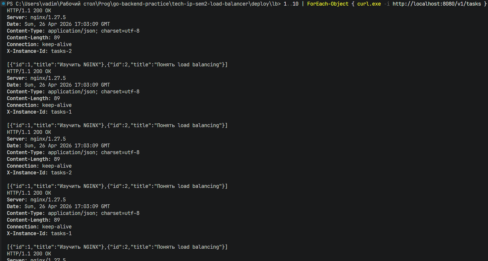
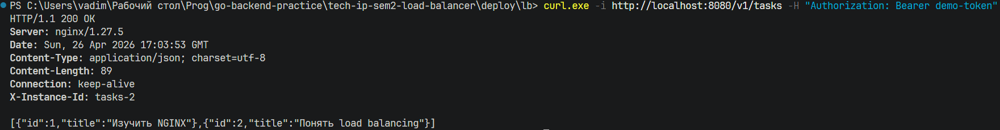
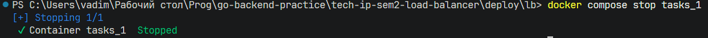
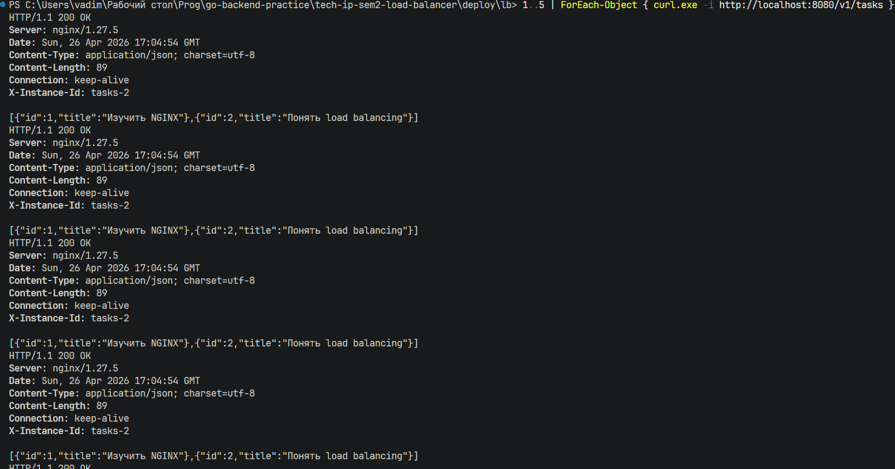
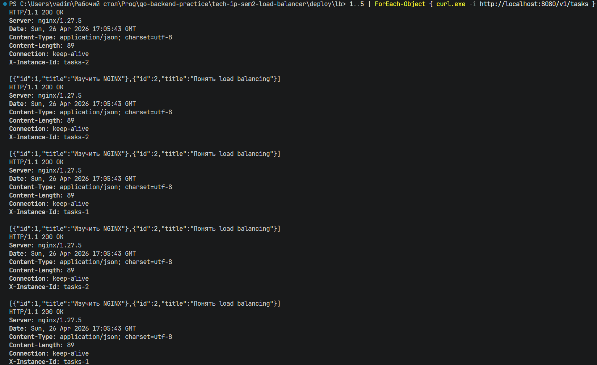

# Практическая работа № 26

Студент: Юркин В.И.

Группа: ПИМО-01-25

Тема: Горизонтальное масштабирование: использование Load Balancer (NGINX)

Цель: Освоить базовый подход к горизонтальному масштабированию backend-приложения за счёт запуска нескольких экземпляров одного сервиса и распределения входящих HTTP-запросов через NGINX в роли балансировщика нагрузки.


## Что реализовано

- минимальный `tasks`-сервис с маршрутами `GET /health`, `GET /v1/tasks` и `GET /whoami`
- чтение `INSTANCE_ID` из переменной окружения
- заголовок `X-Instance-ID` во всех ответах
- `Dockerfile` для сборки контейнера сервиса
- конфигурация NGINX с `upstream tasks_backend`
- Compose-стенд с двумя репликами `tasks_1`, `tasks_2` и одним контейнером `nginx`

## Структура

```text
tech-ip-sem2-load-balancer/           - корень проекта практической работы
├── services/
│   └── tasks/
│       ├── cmd/
│       │   └── server/
│       │       └── main.go           - tasks-сервис с X-Instance-ID
│       ├── .dockerignore             - исключения из build context
│       ├── Dockerfile                - сборка контейнера tasks-сервиса
│       └── go.mod                    - Go-модуль сервиса
├── deploy/
│   └── lb/
│       ├── docker-compose.yml        - запуск двух реплик tasks и NGINX
│       └── nginx.conf                - upstream и reverse proxy конфиг
└── README.md                         - инструкция запуска и проверки
```


## Запуск стенда через Docker Compose

Из каталога `deploy/lb`:

```powershell
docker compose up -d --build
```


Проверка:

```powershell
docker compose ps
```



Внешняя точка входа:

```text
http://localhost:8080
```

## Проверка health endpoint

```powershell
curl.exe -i http://localhost:8080/health
```




## Проверка балансировки

```powershell
1..10 | ForEach-Object { curl.exe -i http://localhost:8080/v1/tasks }
```

Нужно смотреть на заголовок:

```text
X-Instance-ID: tasks-1
```

или

```text
X-Instance-ID: tasks-2
```

Ответы должны распределяться между двумя репликами.



## Проверка прокидывания заголовков через NGINX

```powershell
curl.exe -i http://localhost:8080/v1/tasks -H "Authorization: Bearer demo-token"
```



В этом учебном стенде `tasks` не валидирует токен, но NGINX уже умеет прокидывать `Authorization` и `X-Request-ID` в backend.

## Проверка отказоустойчивости

Остановите одну реплику:

```powershell
docker compose stop tasks_1
```



Потом повторите серию запросов:

```powershell
1..5 | ForEach-Object { curl.exe -i http://localhost:8080/v1/tasks }
```

Ожидаемое поведение:
- стенд продолжает отвечать
- `X-Instance-ID` теперь показывает только `tasks-2`



Возврат реплики:

```powershell
docker compose start tasks_1
```

После этого балансировка должна снова идти между двумя инстансами.



