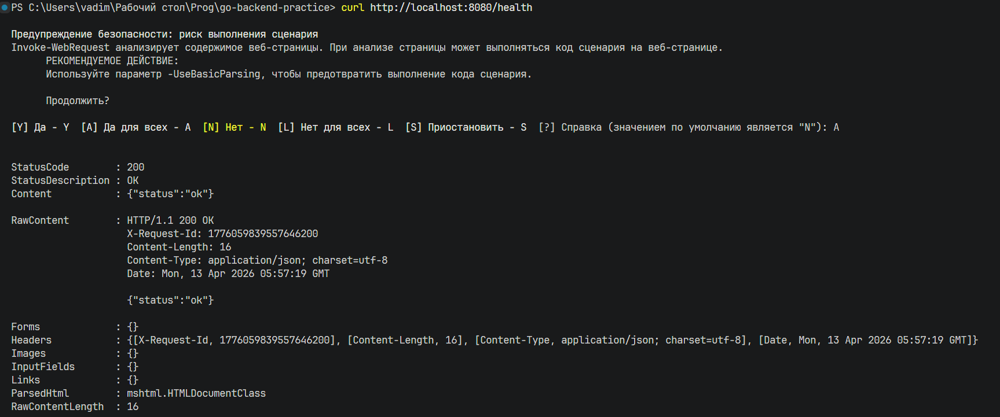
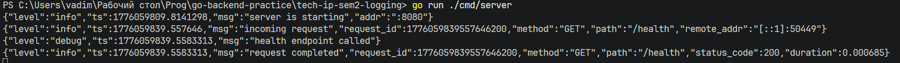
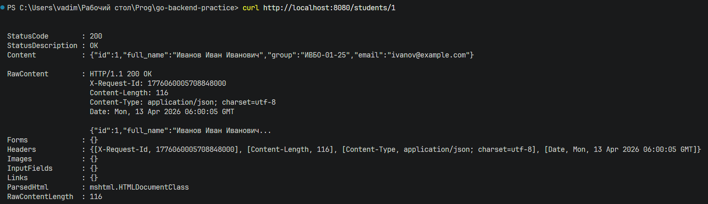
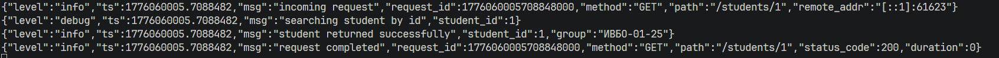
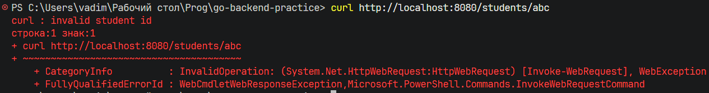

# Практическая работа № 3

Студент: Юркин В.И.
Группа: ПИМО-01-25

Тема: Логирование с помощью zap. Ведение структурированных логов

Цель: Освоить организацию структурированного логирования в backend-приложении на Go с использованием библиотеки zap для записи, анализа и сопровождения событий приложения.

## Структура

```text
tech-ip-sem2-logging/                 - корень проекта практической работы
├── cmd/
│   └── server/
│       └── main.go                    - точка входа и запуск HTTP-сервера
├── internal/
│   ├── httpapi/                       - middleware, handlers и обёртка ResponseWriter
│   │   ├── handler.go                 - обработчики /health и /students/{id}
│   │   ├── middleware.go              - логирование входящих запросов и времени обработки
│   │   └── response_writer.go         - обёртка для установки и получения статуса запроса
│   └── student/                       - модель студента и тестовый репозиторий
│       ├── model.go                   - структура Student
│       └── repo.go                    - in-memory данные и поиск по id
├── pkg/
│   └── logger/
│       └── logger.go                  - настройка zap logger
```

## Запуск

```powershell
go run ./cmd/server
```

Сервис стартует на `http://localhost:8080`.

При необходимости порт можно переопределить:

```powershell
$env:PORT="8081"
go run ./cmd/server
```

## Проверка

### Проверка health

```powershell
curl http://localhost:8080/health
```

Ожидаемый ответ:



Логи сервера:



### Получение студента

```powershell
curl http://localhost:8080/students/1
```

Ожидаемый ответ:



Логи сервера:



### Получение студента с ошибкой (неверный идентификатор)

```powershell
curl http://localhost:8080/students/abc
```

Ожидаемый ответ:



Логи сервера:


