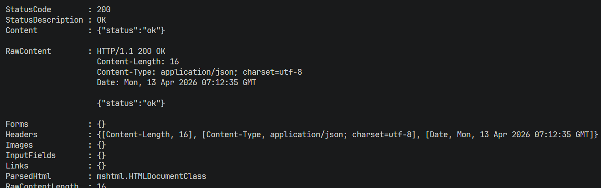
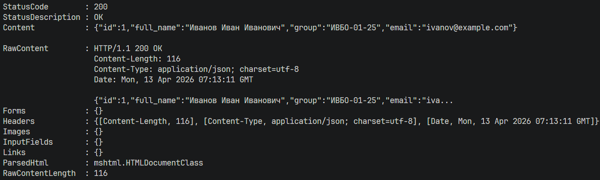
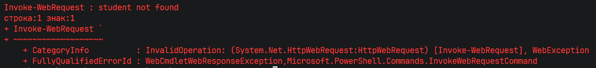
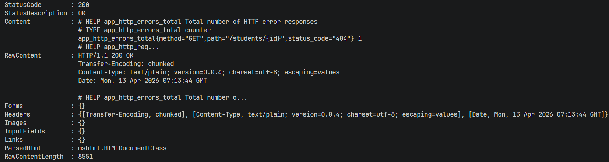
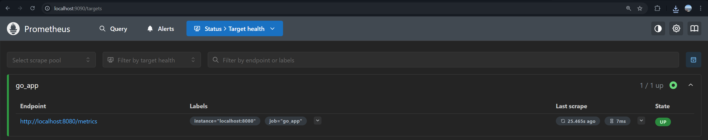
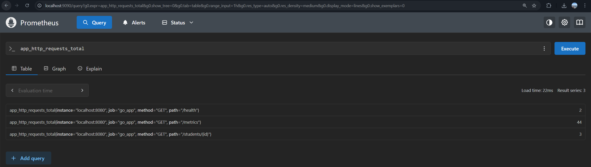
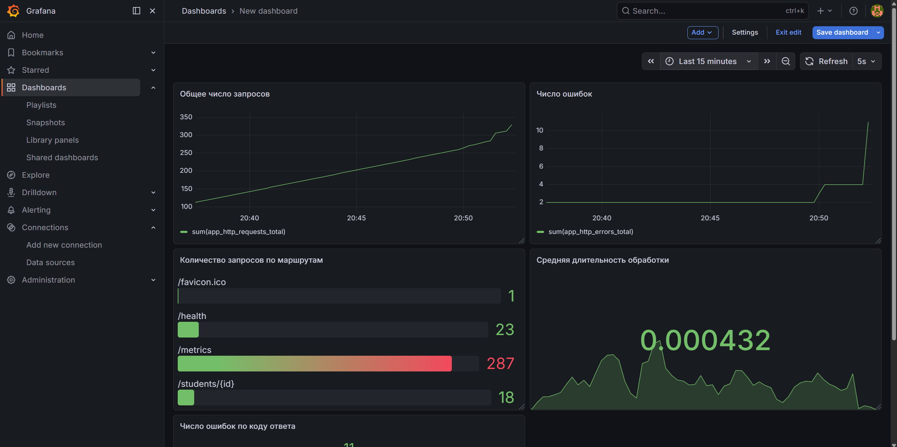

# Практическая работа № 20

Студент: Юркин В.И.

Группа: ПИМО-01-25

Тема: Настройка Prometheus + Grafana для метрик. Интеграция с приложением

Цель: Освоить базовую организацию мониторинга backend-приложения на Go с использованием Prometheus для сбора метрик и Grafana для их визуализации.


## Структура

```text
tech-ip-sem2-monitoring/              - корень проекта практической работы
├── cmd/
│   └── server/
│       └── main.go                   - точка входа и запуск HTTP-сервера
├── internal/
│   ├── httpapi/                      - handlers, middleware и обёртка ResponseWriter
│   │   ├── handler.go                - маршруты /health и /students/{id}
│   │   ├── middleware.go             - запись метрик HTTP-запросов
│   │   └── response_writer.go        - фиксация HTTP-статуса ответа
│   ├── metrics/
│   │   └── metrics.go                - Counter и Histogram метрики приложения
│   └── student/
│       ├── model.go                  - структура Student
│       └── repo.go                   - in-memory репозиторий с тестовыми данными
├── monitoring/
│   └── prometheus.yml                - конфигурация Prometheus для scrape /metrics
├── go.mod                            - Go-модуль проекта
└── README.md                         - инструкция по запуску и проверке
```

## Реализованные метрики

- `app_http_requests_total` - общее количество HTTP-запросов
- `app_http_errors_total` - количество HTTP-ответов с ошибками
- `app_http_request_duration_seconds` - длительность обработки HTTP-запросов


## Запуск Go-приложения


```powershell
go run ./cmd/server
```

По умолчанию приложение запускается на `http://localhost:8080`.

При необходимости можно переопределить порт:

```powershell
$env:PORT="8081"
go run ./cmd/server
```

## Проверка приложения

### Проверка health

```powershell
Invoke-WebRequest `
  -Uri "http://localhost:8080/health" `
  -Method Get
```



### Получение студента

```powershell
Invoke-WebRequest `
  -Uri "http://localhost:8080/students/1" `
  -Method Get
```



### Получение студента (Ошибка 404)

```powershell
Invoke-WebRequest `
  -Uri "http://localhost:8080/students/999" `
  -Method Get
```



### Просмотр метрик

```powershell
Invoke-WebRequest `
  -Uri "http://localhost:8080/metrics" `
  -Method Get
```



После нескольких запросов на `/health` и `/students/{id}` в выводе `/metrics` должны появиться строки:

```text
app_http_requests_total
app_http_errors_total
app_http_request_duration_seconds
```

## Запуск Prometheus

Приложение должно быть запущено до старта Prometheus.

Пример для локального бинарного файла Prometheus:

```powershell
prometheus --config.file=monitoring/prometheus.yml
```

После запуска откройте:
- `http://localhost:9090`
- `Status -> Targets`

Ожидается, что target `go_app` будет в состоянии `UP`.



В строке запроса Prometheus можно проверить:

```promql
app_http_requests_total
```



## Запуск и подключение Grafana

Для запуска grafana введите:
```
docker run -d -p 3000:3000 --name=grafana grafana/grafana
```

После запуска Grafana откройте:

```text
http://localhost:3000
```

Далее:
1. Откройте `Connections`.
2. Перейдите в `Data sources` или `Add new connection`.
3. Выберите `Prometheus`.
4. Укажите URL `http://localhost:9090` (или http://host.docker.internal:9090 если запускали через докер).
5. Сохраните настройки.

## Панели Grafana

Создание дашбордов в графана: https://grafana.com/docs/grafana/latest/fundamentals/getting-started/first-dashboards/get-started-grafana-prometheus/

### Панель 1. Общее число запросов

```promql
sum(app_http_requests_total)
```

### Панель 2. Число ошибок

```promql
sum(app_http_errors_total)
```

### Панель 3. Количество запросов по маршрутам

```promql
sum by (path) (app_http_requests_total)
```

### Панель 4. Средняя длительность обработки

```promql
sum(rate(app_http_request_duration_seconds_sum[1m]))
/
sum(rate(app_http_request_duration_seconds_count[1m]))
```

### Панель 5. Число ошибок по коду ответа

```promql
sum by (status_code) (app_http_errors_total)
```

