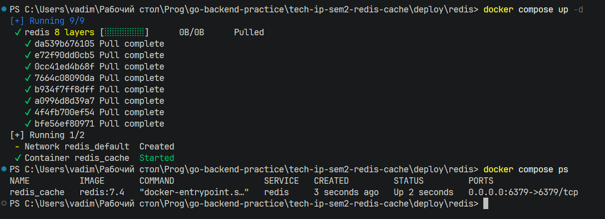
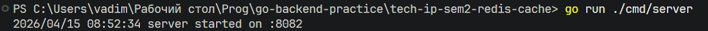
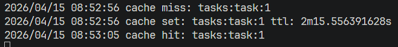
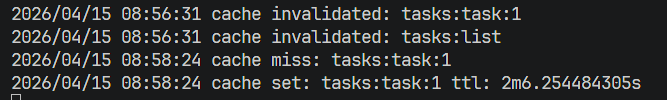
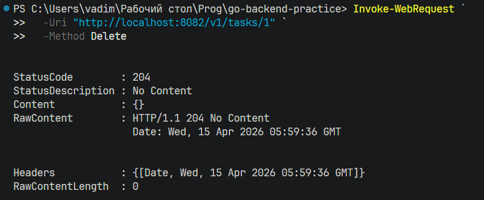
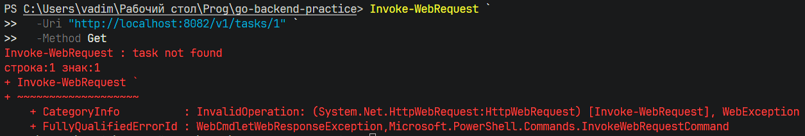
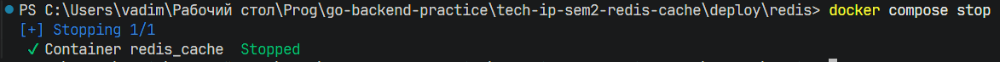
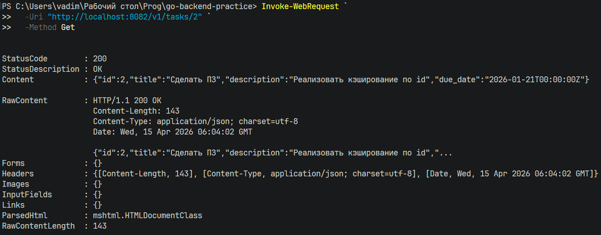
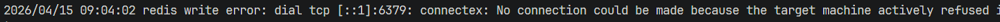

# Практическая работа № 25

Студент: Юркин В.И.

Группа: ПИМО-01-25

Тема: Реализация распределённого кэша (Redis cluster)

Цель: Освоить внедрение распределённого кэша в backend-приложение на Go и реализовать стратегию cache-aside с использованием Redis, корректного TTL, jitter и устойчивого поведения сервиса при недоступности кэша


## Что реализовано

- `GET /v1/tasks/` и `GET /v1/tasks/{id}` с cache-aside чтением через Redis
- `PATCH /v1/tasks/{id}` и `DELETE /v1/tasks/{id}` с инвалидацией кэша
- Redis-клиент с таймаутами подключения, чтения и записи
- Логирование cache-hit, cache-miss, cache-invalidation
- TTL и случайный jitter для кэшируемой сущности
- устойчивое поведение при недоступности Redis: API продолжает работать через основной репозиторий
- учебный Redis-стенд через Docker Compose

## Структура

```text
tech-ip-sem2-redis-cache/             - корень проекта практической работы
├── cmd/
│   └── server/
│       └── main.go                   - запуск HTTP-сервиса и Redis-клиента
├── internal/
│   ├── cache/
│   │   ├── keys.go                   - генерация ключей Redis
│   │   ├── redis.go                  - создание Redis client и ping
│   │   └── ttl.go                    - расчёт TTL с jitter
│   ├── config/
│   │   └── config.go                 - адрес Redis, TTL и таймауты
│   ├── httpapi/
│   │   └── handler.go                - HTTP handlers GET/PATCH/DELETE
│   ├── service/
│   │   └── task_service.go           - cache-aside логика и инвалидация кэша
│   └── task/
│       ├── model.go                  - модель Task
│       └── repo.go                   - in-memory источник истины
├── deploy/
│   └── redis/
│       └── docker-compose.yml        - локальный Redis-стенд
├── go.mod                            - Go-модуль проекта
```

## Запуск Redis

Из каталога `deploy/redis`:

```powershell
docker compose up -d
docker compose ps
```



## Запуск сервиса

```powershell
go run ./cmd/server
```

Сервис стартует на:



## Проверка cache miss и cache hit

Первый запрос:

```powershell
Invoke-WebRequest `
  -Uri "http://localhost:8082/v1/tasks/1" `
  -Method Get
```

Второй запрос:

```powershell
Invoke-WebRequest `
  -Uri "http://localhost:8082/v1/tasks/1" `
  -Method Get
```

Ожидаемое поведение:
- первый запрос идёт в репозиторий и заполняет Redis
- второй запрос отдаётся из Redis

По логам видны сообщения:



## Проверка инвалидации при PATCH

```powershell
$body = @{
  title = "Обновлённая задача"
  description = "Новый текст"
  due_date = "2026-01-22T00:00:00Z"
} | ConvertTo-Json -Compress

Invoke-WebRequest `
  -Uri "http://localhost:8082/v1/tasks/1" `
  -Method Patch `
  -ContentType "application/json; charset=utf-8" `
  -Body $body

```

Затем:

```powershell
Invoke-WebRequest `
  -Uri "http://localhost:8082/v1/tasks/1" `
  -Method Get
```

После `PATCH` ключ `tasks:task:1` должен быть удалён и следующий `GET` снова заполнит кэш свежими данными.



## Проверка удаления

```powershell
Invoke-WebRequest `
  -Uri "http://localhost:8082/v1/tasks/1" `
  -Method Delete

Invoke-WebRequest `
  -Uri "http://localhost:8082/v1/tasks/1" `
  -Method Get
```

Ожидаемый результат:
- `DELETE` возвращает `204 No Content`
- повторный `GET` возвращает `404 Not Found`






## Проверка деградации при остановке Redis

Остановите Redis:

```powershell
cd deploy/redis
docker compose stop
```



После этого:

```powershell
Invoke-WebRequest `
  -Uri "http://localhost:8082/v1/tasks/2" `
  -Method Get
```

Ожидаемое поведение:
- сервис не падает
- запрос не зависает надолго
- задача возвращается из основного репозитория
- в логах появляется предупреждение об ошибке Redis




