# Практическая работа № 31

Студент: Юркин В.И.

Группа: ПИМО-01-25

Тема: Студент: Юркин В.И.

Группа: ПИМО-01-25

Тема: Реализация очереди задач (producer–consumer)

Цель: Освоить публикацию backend-приложения на удалённом Linux-сервере, научиться подключаться к VPS по SSH, размещать исполняемый файл приложения, настраивать переменные окружения, создавать unit-файл systemd, управлять сервисом через systemctl, анализировать логи через journalctl и выполнять базовую процедуру обновления версии приложения

## Пошаговое выполнение работы

### 1. Подключиться к VPS по SSH

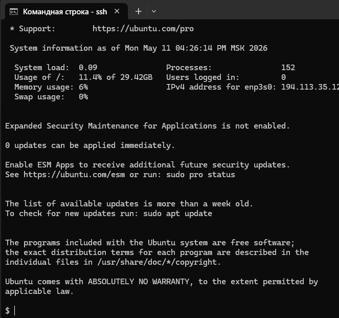

### 2. Обновить пакеты на сервере

### 3. Создать отдельного пользователя для сервиса

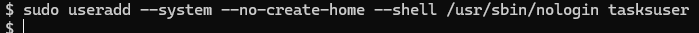

### 4. Создать директорию приложения

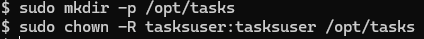

### 5. Подготовить конфигурационный файл
Создайте отдельную директорию для конфигурации:

После сохранения задайте безопасные права:

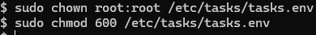

Это означает, что читать и изменять файл сможет только root.
### 6. Собрать Linux-бинарник на локальной машине

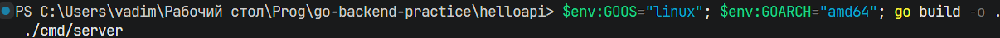

### 7. Скопировать бинарник на VPS

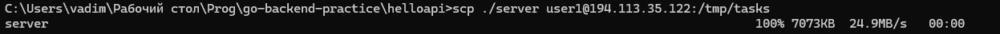

### 8. Переместить бинарник в рабочую директорию

Теперь бинарник размещён в целевой директории и готов к запуску.
### 9. Создать unit-файл systemd
Создайте файл службы:

Добавьте следующий текст:
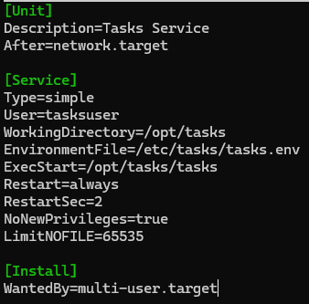

### 10. Разобрать назначение параметров unit-файла
Основные параметры:
Description — краткое описание службы;
After=network.target — запускать сервис после инициализации сети;
User=tasksuser — запуск не от root, а от отдельного пользователя;
WorkingDirectory=/opt/tasks — рабочая директория приложения;
EnvironmentFile=/etc/tasks/tasks.env — подключение внешнего файла конфигурации;
ExecStart=/opt/tasks/tasks — команда запуска приложения;
Restart=always — всегда перезапускать сервис при аварийном завершении;
RestartSec=2 — подождать 2 секунды перед повторным запуском;
NoNewPrivileges=true — ограничить получение дополнительных привилегий процессом;
LimitNOFILE=65535 — увеличить лимит открытых файлов;
WantedBy=multi-user.target — включить службу в обычный многопользовательский режим запуска системы.

### 11. Перечитать конфигурацию systemd
После создания unit-файла необходимо сообщить systemd, что появилась новая служба:

### 12. Запустить сервис

### 13. Включить автозапуск
Чтобы сервис автоматически стартовал после перезагрузки VPS, выполните:

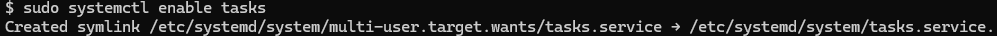

### 14. Проверить статус сервиса

### 15. Посмотреть логи через journalctl

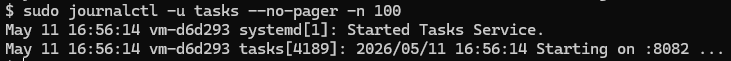

### 16. Проверить доступность приложения
Локальная проверка на VPS:

Проверка с другого компьютера:
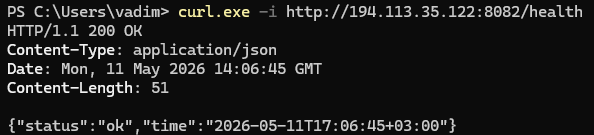
### 17. Зафиксировать базовые команды управления сервисом
Для управления службой используются следующие команды:
Запуск:
sudo systemctl start tasks
Остановка:
sudo systemctl stop tasks
Перезапуск:
sudo systemctl restart tasks
Проверка статуса:
sudo systemctl status tasks
Отключение автозапуска:
sudo systemctl disable tasks

### 18. Выполнить обновление версии приложения

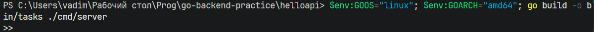

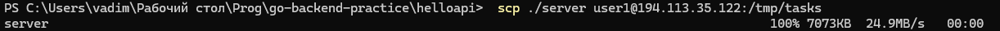

### 19. Выполнить откат при неудачном обновлении

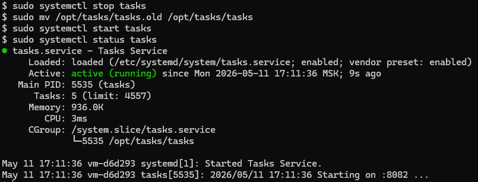

### 20. Зафиксировать замечание по портам и безопасности

