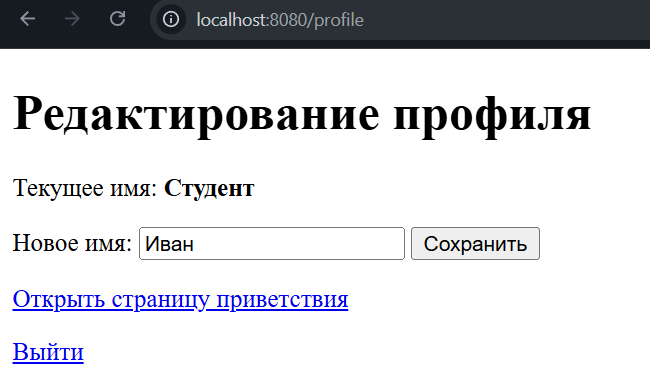
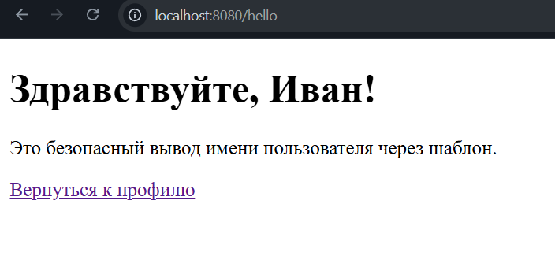
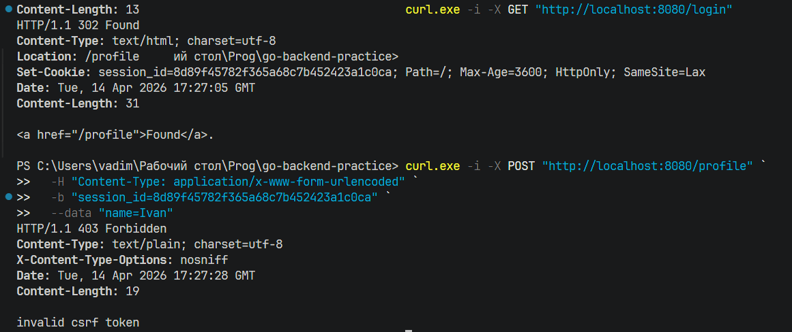
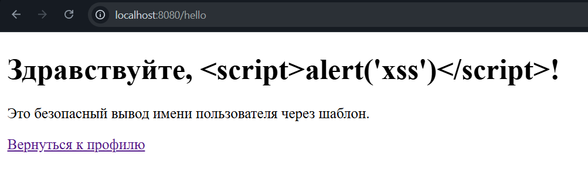

# Практическая работа № 22

Студент: Юркин В.И.

Группа: ПИМО-01-25

Тема: Реализация защиты от CSRF/XSS. Работа с secure cookies

Цель: Освоить базовые практические подходы к защите web-приложения на Go от CSRF- и XSS-угроз, а также научиться безопасно использовать cookies для аутентификации и хранения пользовательского состояния.

## Структура

```text
tech-ip-sem2-web-security/            - корень проекта практической работы
├── cmd/
│   └── server/
│       └── main.go                   - запуск HTTP-сервера и маршрутов приложения
├── internal/
│   ├── auth/
│   │   ├── cookie.go                 - установка, чтение и очистка secure cookies
│   │   └── csrf.go                   - генерация случайных session-id и CSRF-токенов
│   ├── httpapi/
│   │   └── handler.go                - handlers login/profile/hello/logout
│   └── store/
│       └── store.go                  - in-memory хранилище профилей и CSRF-токенов
├── templates/
│   ├── hello.html                    - безопасная HTML-страница приветствия
│   └── profile.html                  - HTML-форма с hidden CSRF-полем
├── go.mod                            - Go-модуль проекта
└── README.md                         - инструкция запуска и проверки
```

## Запуск приложения

```powershell
go run ./cmd/server
```


## Проверка сценария

### 1. Вход и установка cookie

Откройте в браузере:

```text
http://localhost:8080/login
```

Сервер создаст сессию, установит cookie и перенаправит на `/profile`.

### 2. Успешное изменение имени

На странице `/profile` введите, например:

```text
Иван
```



После отправки формы откроется `/hello` с сообщением:

```text
Здравствуйте, Иван!
```



### 3. Ошибка CSRF

Если отправить `POST /profile` без `csrf_token` или с неверным значением, сервер вернёт:



### 4. Проверка XSS

Введите в поле имени:

```text
<script>alert('xss')</script>
```

На странице `/hello` должно отобразиться именно текстовое значение, а не выполниться JavaScript.




## О безопасности

### Безопасные cookie

В проекте сессионная cookie создаётся с такими атрибутами:
- `HttpOnly: true` - JavaScript в браузере не может читать cookie
- `SameSite: Lax` - снижает риск части межсайтовых сценариев CSRF
- `Secure: false` - оставлено так только для локального HTTP-запуска учебной версии

Если запускать приложение по HTTPS, `Secure` нужно переключать в `true`.

### Как работает CSRF-защита

1. При `GET /login` создаётся новая сессия и отдельный CSRF-токен.
2. Session ID сохраняется в cookie `session_id`.
3. CSRF-токен сохраняется в серверном in-memory хранилище.
4. При `GET /profile` токен подставляется в скрытое поле HTML-формы.
5. При `POST /profile` сервер сравнивает токен из формы и токен текущей сессии.
6. Если токен неверный или отсутствует, сервер отвечает `403 Forbidden`.

После успешного изменения имени CSRF-токен ротируется.

### Как предотвращается XSS

Имя пользователя выводится не через ручную конкатенацию HTML-строк, а через `html/template`.

Безопасный вариант в проекте:

```go
if err := h.helloTmpl.Execute(w, data); err != nil {
    http.Error(w, "template error", http.StatusInternalServerError)
    return
}
```

Опасный вариант, который использовать нельзя:

```go
func unsafeHello(w http.ResponseWriter, name string) {
    html := "<html><body><h1>Здравствуйте, " + name + "!</h1></body></html>"
    w.Header().Set("Content-Type", "text/html; charset=utf-8")
    _, _ = w.Write([]byte(html))
}
```