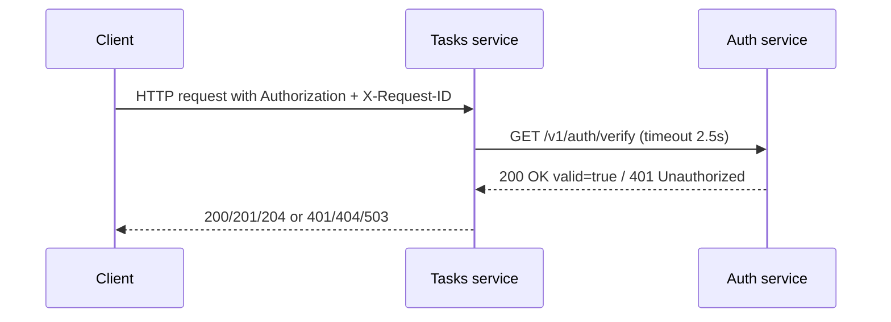

# PZ17 Diagram

```mermaid
sequenceDiagram
    participant C as Client
    participant T as Tasks service
    participant A as Auth service

    C->>T: HTTP request with Authorization + X-Request-ID
    T->>A: GET /v1/auth/verify (timeout 2.5s)
    A-->>T: 200 OK valid=true / 401 Unauthorized
    T-->>C: 200/201/204 or 401/404/503
```
