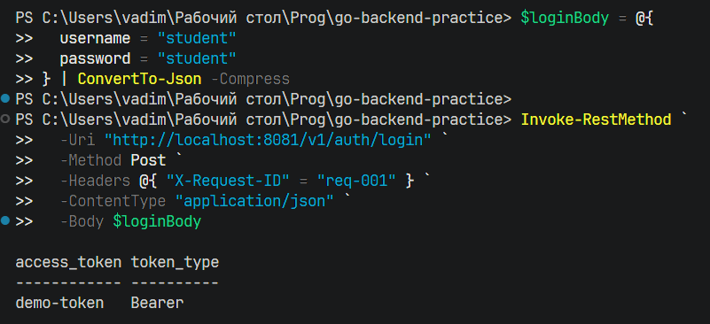
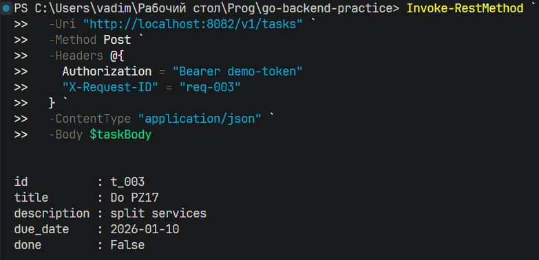
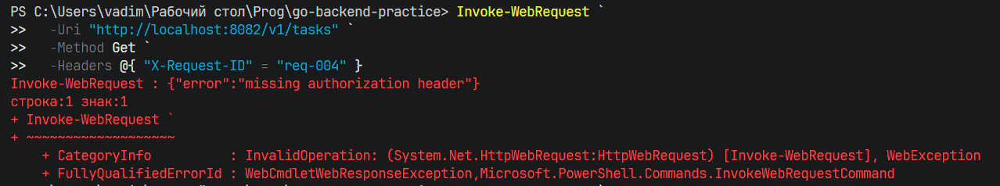
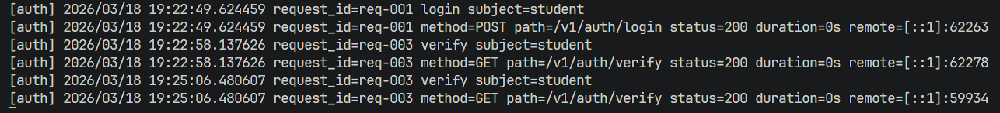
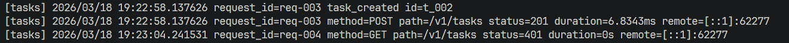

## Демонстрация работы сервисов и request-id в логах

### Получить токен:

```powershell
$loginBody = @{
  username = "student"
  password = "student"
} | ConvertTo-Json -Compress

Invoke-RestMethod `
  -Uri "http://localhost:8081/v1/auth/login" `
  -Method Post `
  -Headers @{ "X-Request-ID" = "req-001" } `
  -ContentType "application/json" `
  -Body $loginBody
```

Результат:


### Создать задачу:

```powershell
$taskBody = @{
  title = "Do PZ17"
  description = "split services"
  due_date = "2026-01-10"
} | ConvertTo-Json -Compress

Invoke-RestMethod `
  -Uri "http://localhost:8082/v1/tasks" `
  -Method Post `
  -Headers @{
    Authorization = "Bearer demo-token"
    "X-Request-ID" = "req-003"
  } `
  -ContentType "application/json" `
  -Body $taskBody
```

Результат:



### Запрос без токена:

```powershell
Invoke-WebRequest `
  -Uri "http://localhost:8082/v1/tasks" `
  -Method Get `
  -Headers @{ "X-Request-ID" = "req-004" }
```

Результат:



### Логи



